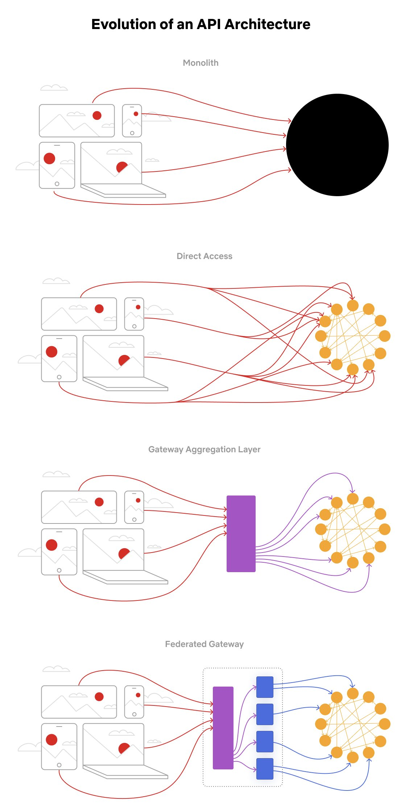

## [Evolution of the Netflix API architecture](https://twitter.com/alexxubyte/status/1529489377432199168)

> The Netflix API architecture went through 4 main stages.

1. Monolith
>  The application is packaged and deployed as a monolith, such as a single Java WAR file, Rails app, etc. Most startups begin with a monolith architecture.
2. Direct Access
>  In this architecture, a client app can make requests directly to the microservices. With hundreds or even thousands of microservices, exposing all of them to clients is not ideal.
3. Gateway aggregation layer
>  Some use cases may span multiple services, we need a gateway aggregation layer. Imagine the Netflix app needs 3 APIs (movie, production, talent) to render the frontend. The gateway aggregation layer makes it possible.
4. Federated gateway
> As the number of developers grew and domain complexity increased, developing the API aggregation layer became increasingly harder. GraphQL federation allows Netflix to set up a single GraphQL gateway that fetches data from all the other APIs.