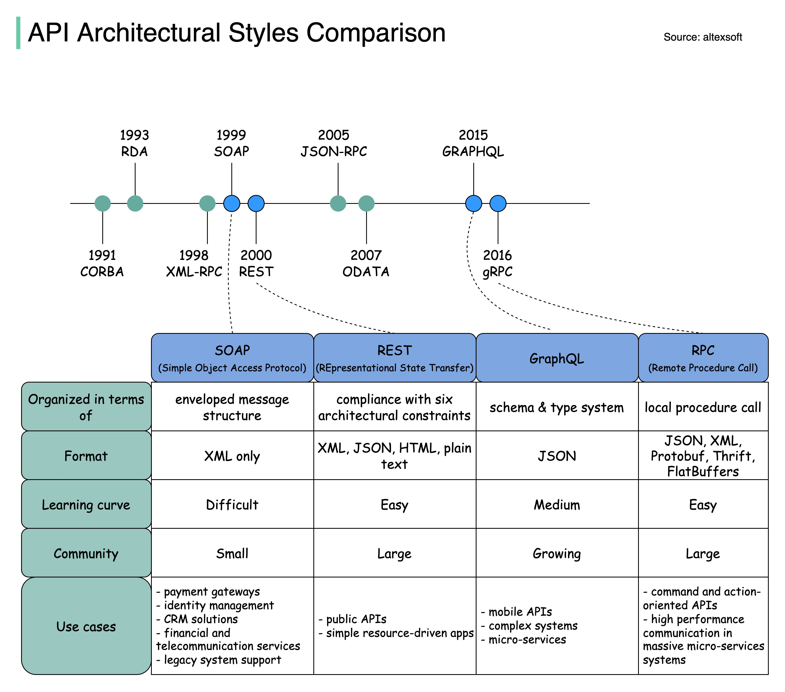

## [SOAP vs REST vs GraphQL vs RPC](https://twitter.com/alexxubyte/status/1506298328878780419)

> Over time, different API architectural styles are released. Each of them has its own patterns of standardizing data exchange.
> 
> The diagram below illustrates the API timeline and API styles comparison.

