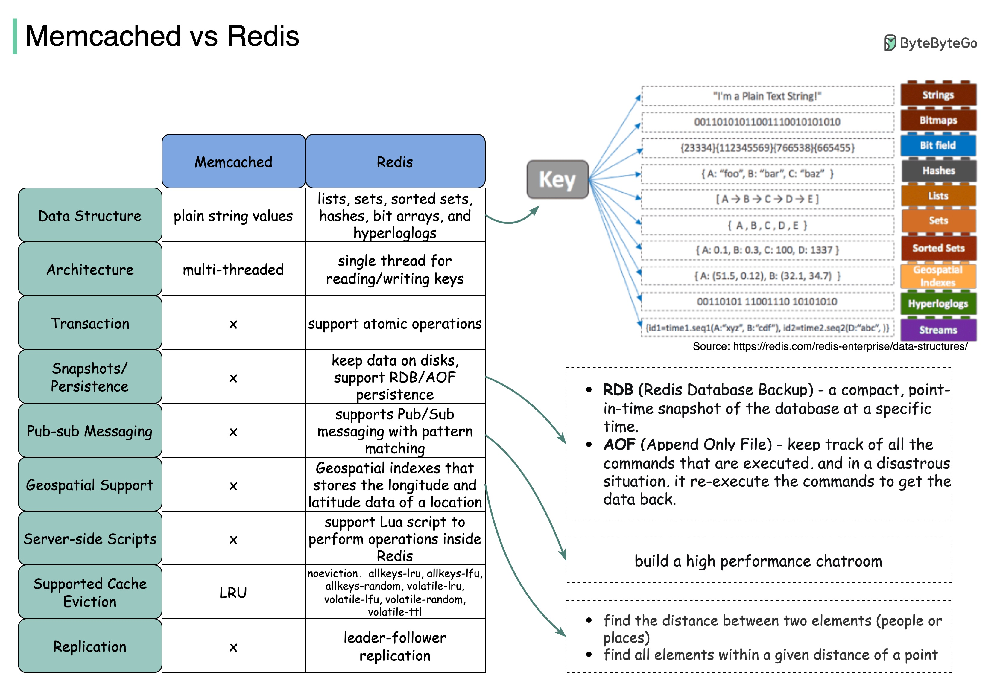

## [Redis vs Memcached](https://blog.bytebytego.com/p/redis-vs-memcached?s=r)

> what are the differences between Redis and Memcached?
>
> The diagram below illustrates the key differences.

> The advantages of data structures make Redis a good choice for:

🔹 Recording the number of clicks and comments for each post (hash)

🔹 Sorting the commented user list and deduping the users (zset)

🔹 Caching user behavior history and filtering malicious behaviors (zset, hash)

🔹 Storing boolean information of extremely large data into small space. For example, login status, membership status. (bitmap)