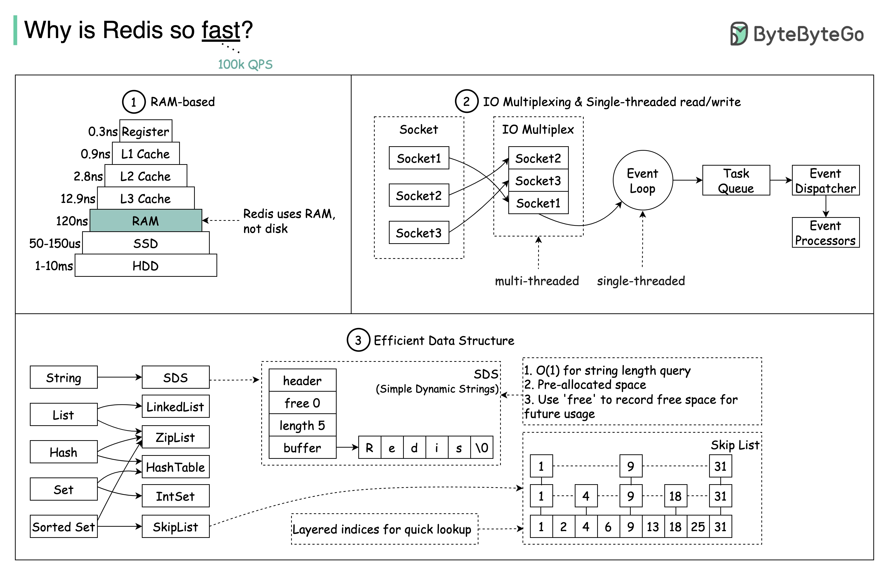

## [Why is redis so fast?](https://blog.bytebytego.com/p/why-is-redis-so-fast?s=r)

> Why is Redis so fast? There are 3 main reasons as shown in the diagram below.

1. Redis is a RAM-based database. RAM access is at least 1000 times faster than random disk access.

2. Redis leverages IO multiplexing and single-threaded execution loop for execution efficiency.

3. Redis leverages several efficient lower-level data structures.