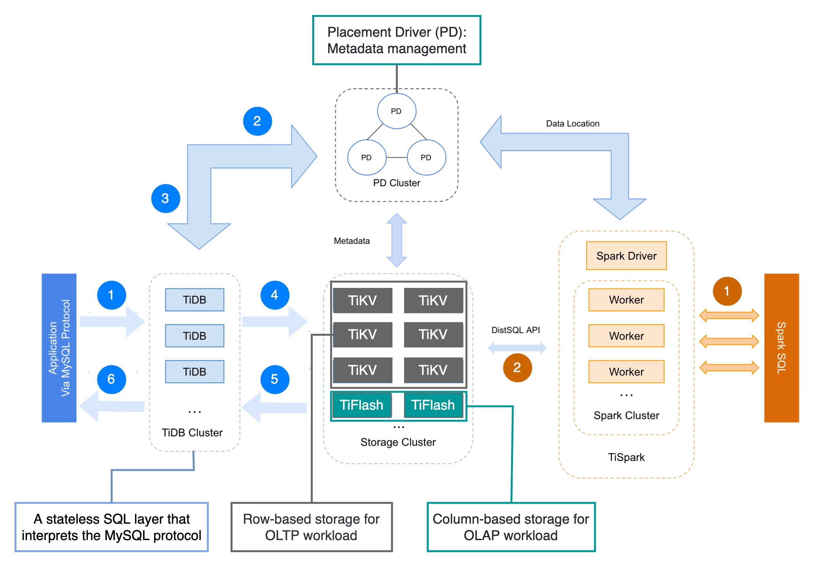

## [What is Distributed SQL?](https://twitter.com/alexxubyte/status/1542531936706392064)

> What is Distributed SQL? Why do we need it? How does it work?
>
> Google Spanner popularized the term Distributed SQL database in 2012. Distributed SQL databases 𝐚𝐮𝐭𝐨𝐦𝐚𝐭𝐢𝐜𝐚𝐥𝐥𝐲 𝐫𝐞𝐩𝐥𝐢𝐜𝐚𝐭𝐞 𝐝𝐚𝐭𝐚 to multiple nodes and are 𝐬𝐭𝐫𝐨𝐧𝐠𝐥𝐲 𝐜𝐨𝐧𝐬𝐢𝐬𝐭𝐞𝐧𝐭.
> 
> 𝐏𝐚𝐱𝐨𝐬 𝐨𝐫 𝐑𝐚𝐟𝐭 algorithms are commonly used to achieve consensus across multiple nodes.
>
> Examples of Distributed SQL databases: Google Spanner, Amazon Aurora, CockroachDB, YugabyteDB, TiDB, etc.
>
> Terms:
OLTP = Online transactional processing
OLAP = Online analytical processing
HTAP = Hybrid transaction/analytical processing
> 

🔹The life of an OLTP query (marked with 𝐛𝐥𝐮𝐞 sequence numbers):

Step 1. A client sends a MySQL query and the query is interpreted by TiDB, a stateless layer that interprets the MySQL protocol.

Step 2: TiDB requests data mapping/placement information from the PD.

Step 3: PD responds with data mapping/ placement instructions & timestamp.

Step 4: TiDB executes queries on TiKV servers (row-based storage)

Step 5, 6: Query results are sent back to the client

🔹The life of a complex 𝐎𝐋𝐀𝐏 query: follow the 𝐲𝐞𝐥𝐥𝐨𝐰 sequence numbers