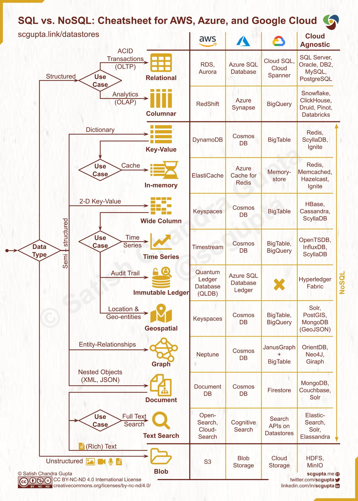

## [How to choose the right Database?](https://twitter.com/alexxubyte/status/1519706088391602176)

> Picking a database is a long-term commitment so the decision shouldn’t be made lightly. The important thing to keep in mind is to choose the right database for the right job.
>
> A visual guide on how to choose the right Database:

> Data can be structured (SQL), semi-structured (JSON), and unstructured (Blob).
> Common DB categories:

- Relational
- Columnar
- Key-value
- In-memory
- Wide column
- Time Series
- Immutable ledger
- Geospatial
- Graph
- Document
- Text search
- Blob