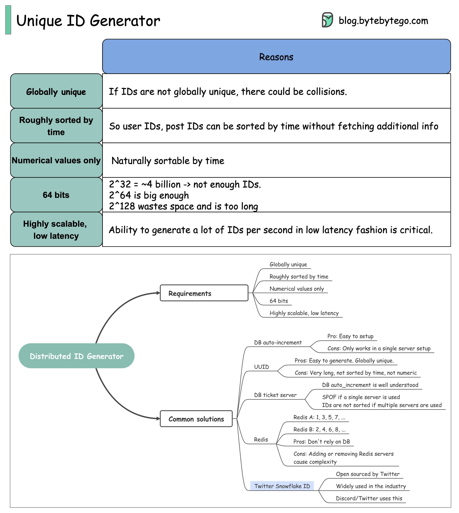

## [How to generate globally unique IDs?](https://twitter.com/alexxubyte/status/1519706088391602176)

> Here explores common requirements for IDs that are used in social media such as Facebook, Twitter, and LinkedIn.

- Globally unique
- Roughly sorted by time
- Numerical values only
- 64-bit
- Highly scalable, low latency