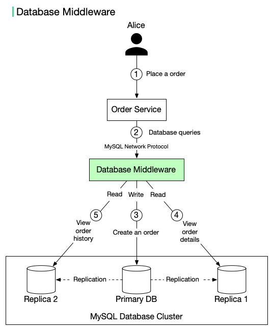

## [How to implement read replica pattern?](https://blog.bytebytego.com/p/how-to-implement-read-replica-pattern?s=r)

> There are two common ways to implement the read replica pattern:
> 1. Embed the routing logic in the application code (explained in the last post).
> 2. Use database middleware.
> 
> We focus on option 2 here. The middleware provides transparent routing between the application and database servers. We can customize the routing logic based on difficult rules such as user, schema, statement, etc.
>
> The diagram below illustrates the setup:

1. When Alice places an order on amazon, the request is sent to Order Service.

2. Order Service does not directly interact with the database. Instead, it sends database queries to the database middleware.

3. The database middleware routes writes to the primary database. Data is replicated to two replicas.

4. Alice views the order details (read). The request is sent through the middleware.

5. Alice views the recent order history (read). The request is sent through the middleware.

> The database middleware acts as a proxy between the application and databases. It uses standard MySQL network protocol for communication.

#### Pros:
- Simplified application code. The application doesn’t need to be aware of the database topology and manage access to the database directly.

- Better compatibility. The middleware uses the MySQL network protocol. Any MySQL compatible client can connect to the middleware easily. This makes database migration easier.

#### Cons:
- Increased system complexity. A database middleware is a complex system. Since all database queries go through the middleware, it usually requires a high availability setup to avoid a single point of failure.

- Additional middleware layer means additional network latency. Therefore, this layer requires excellent performance.