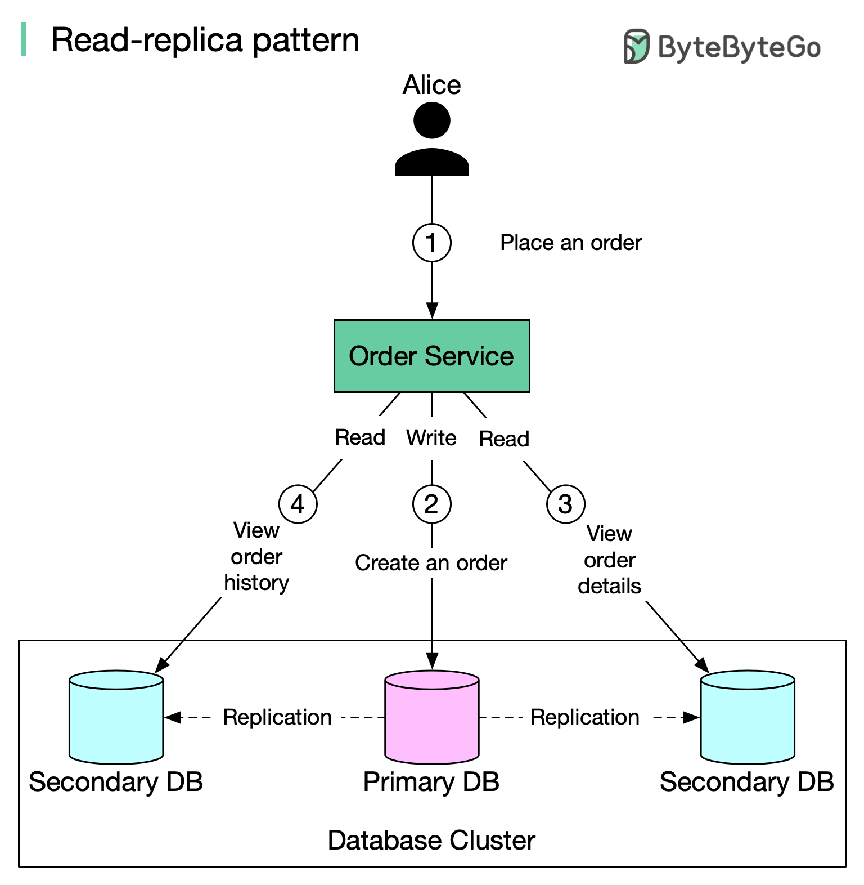

## [Read replica pattern](https://blog.bytebytego.com/p/read-replica-pattern?s=r)

> In this post, we talk about a simple yet commonly used database design pattern (setup): **Read replica pattern**.
>
> In this setup, all data-modifying commands like insert, delete, or update are sent to the primary DB and reads are sent to read replicas.
>
> The diagram below illustrates the setup:

1. When Alice places an order on amazon.com, the request is sent to Order Service.

2. Order Service creates a record about the order in the primary DB (write). Data is replicated to two replicas.

3. Alice views the order details. Data is served from a replica (read).

4. Alice views the recent order history. Data is served from a replica (read).

> There is one major problem in this setup: replication lag.

Under certain circumstances (network delay, server overload, etc.), data in replicas might be seconds or even minutes behind. In this case, if Alice immediately checks the order status (query is served by the replica) after the order is placed, she might not see the order at all. This leaves Alice confused. In this case, we need “read-after-write” consistency.

> Possible solutions to mitigate this problem:

1️⃣ Latency sensitive reads are sent to the primary database.

2️⃣ Reads that immediately follow writes are routed to the primary database.

3️⃣ A relational DB generally provides a way to check if a replica is caught up with the primary. If data is up to date, query the replica. Otherwise fail the read request or read from the primary.