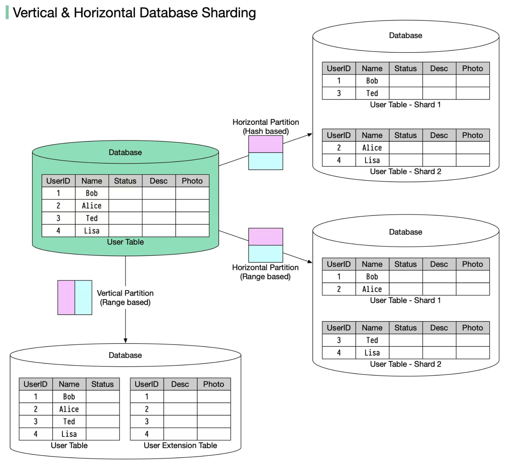

## [Vertical partitioning vs horizontal partitioning](https://blog.bytebytego.com/p/vertical-partitioning-vs-horizontal?s=r)

> In many large-scale applications, data is divided into partitions that can be accessed separately. There are two typical strategies for partitioning data.

🔹 Vertical partitioning: it means some columns are moved to new tables. Each table contains the same number of rows but fewer columns (see diagram below).

🔹 Horizontal partitioning (often called sharding): it divides a table into multiple smaller tables. Each table is a separate data store, and it contains the same number of columns, but fewer rows (see diagram below).

### Routing algorithm
> The routing algorithm decides which partition (shard) stores the data.

🔹 Range-based sharding. This algorithm uses ordered columns, such as integers, longs, timestamps, to separate the rows. For example, the diagram below uses the User ID column for range partition: User IDs 1 and 2 are in shard 1, User IDs 3 and 4 are in shard 2.

🔹 Hash-based sharding. This algorithm applies a hash function to one column or several columns to decide which row goes to which table. For example, the diagram below uses User ID mod 2 as a hash function. User IDs 1 and 3 are in shard 1, User IDs 2 and 4 are in shard 2.

### Benefits

🔹 Facilitate horizontal scaling. Sharding facilitates the possibility of adding more machines to spread out the load.

🔹 Shorten response time. By sharding one table into multiple tables, queries go over fewer rows, and results are returned much more quickly.

### Drawbacks
🔹 The order by operation is more complicated. Usually, we need to fetch data from different shards and sort the data in the application's code.

🔹 Uneven distribution. Some shards may contain more data than others (this is also called the hotspot).