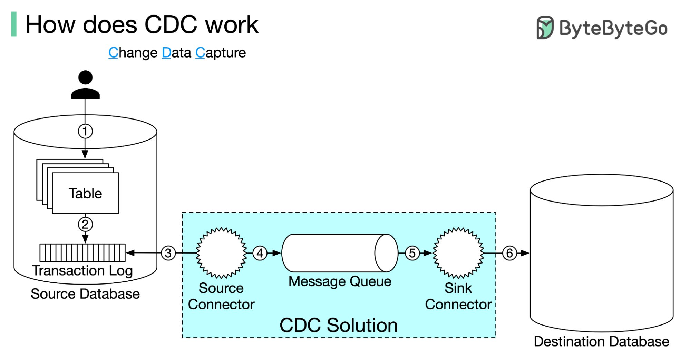

## [How does CDC work?](https://twitter.com/alexxubyte/status/1527318907786186753)

> Data stored in the database could be interesting to many other data systems, such as analytics, AI, etc. If we have thousands of data systems, do we have to write thousands of converters?
>
> The answer is NO. Change data capture (CDC) is a process that can solve the problem. This is how CDC works:

1. Data is written to the database normally.
2. Database uses the transaction log to record the modifications.
3. CDC software uses the source connector to connect to the database and reads the transaction log.
4. The source connector publishes the log to the message queue.
5. CDC software uses its sink connector to consume the log.
6. The sink connector writes the log content to the destination.

> All these operations except step 1 are transparent to the user. Popular CDC solutions, such as Debezium, have connectors for most databases, such as MySQL, PostgreSQL, DB2, Oracle, etc.
> 
> We only need to set up the CDC link between two databases and the data will automatically flow to the destination.