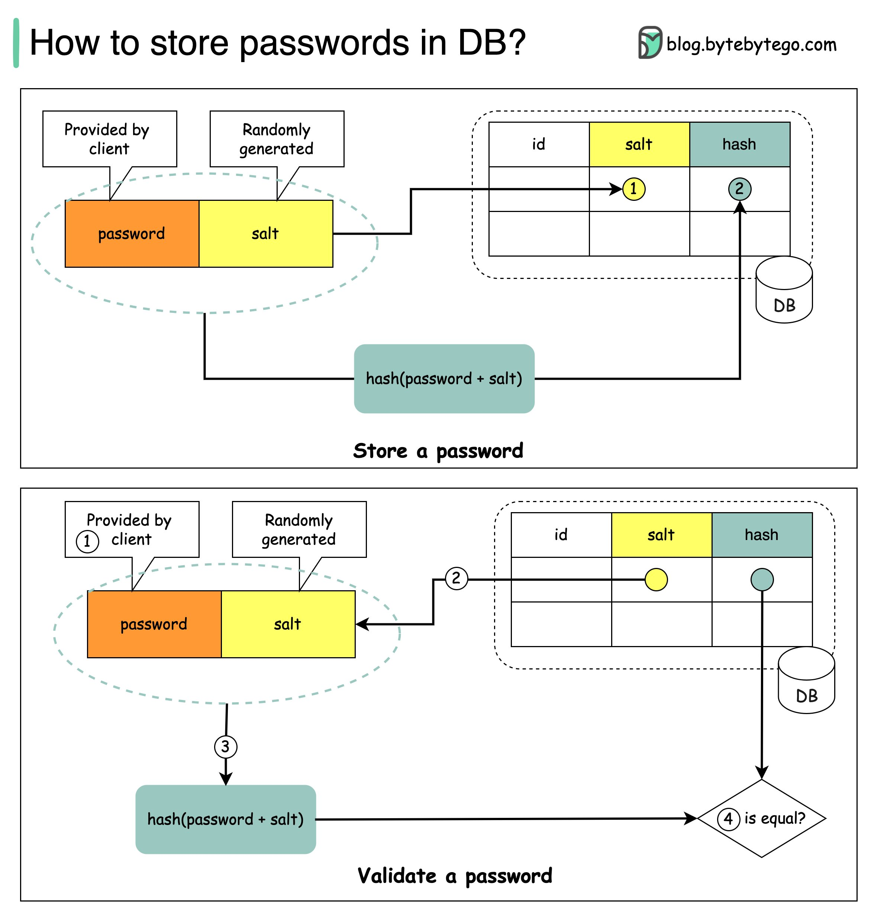

## [How to store passwords in DB?](https://twitter.com/alexxubyte/status/1522242694004674560)

> #### Things not to do
> - Storing passwords in plain text is not a good idea because anyone with internal access can see them.
> - Storing password hashes directly is not sufficient because it is pruned to precomputation attacks, such as rainbow tables.

> To mitigate precomputation attacks, we salt the passwords.

### What is salt?
- According to OWASP guidelines, “a salt is a unique, randomly generated string that is added to each password as part of the hashing process”.

### How to store a password and salt?
1. A salt is not meant to be secret and it can be stored in plain text in the database. It is used to ensure the hash result is unique to each password.
2. The password can be stored in the database using the following format: `𝘩𝘢𝘴𝘩(𝘱𝘢𝘴𝘴𝘸𝘰𝘳𝘥 + 𝘴𝘢𝘭𝘵)`.

### How to validate a password?
1. A client enters the password.
2. The system fetches the corresponding salt from the database.
3. The system appends the salt to the password and hashes it. Let’s call the hashed value H1.
4. The system compares H1 and H2 (H2 is the hash stored in the database). If they are the same, the password is valid

