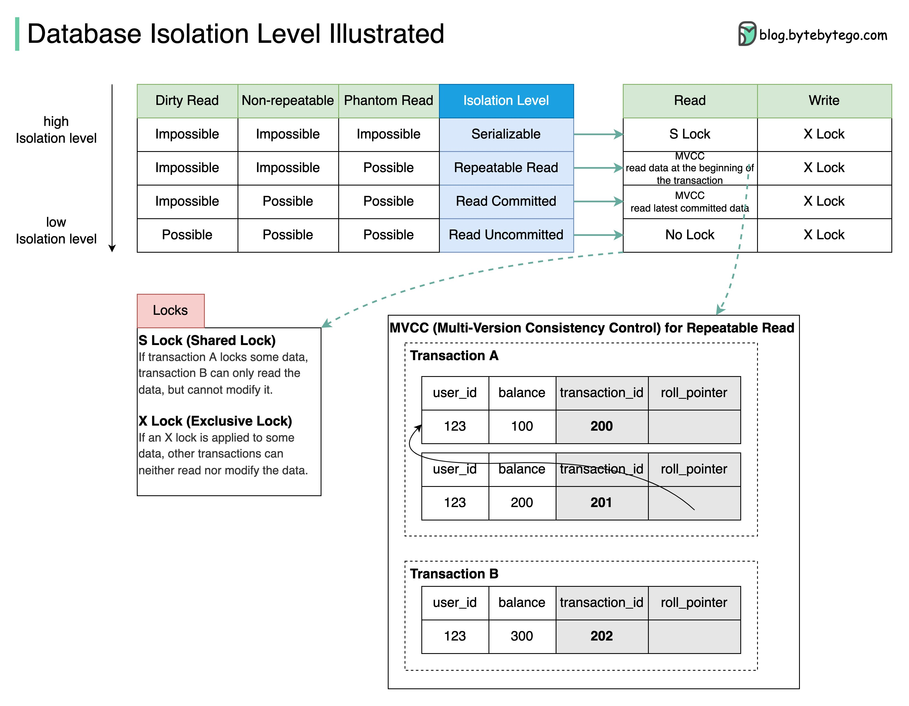

## [What are database isolation levels?](https://twitter.com/alexxubyte/status/1526234911178272768)

> Database isolation allows a transaction to execute as if there are no other concurrently running transactions.
>
> There are four isolation levels.

- Serializable: This is the highest isolation level. Concurrent transactions are guaranteed to be executed in sequence.
- Repeatable Read: Data read during the transaction stays the same as the transaction starts.
- Read Committed: Data modification can only be read after the transaction is committed.
- Read Uncommitted: The data modification can be read by other transactions before a transaction is committed.

> The isolation is guaranteed by MVCC(Multi-Version Consistency Control) and locks
> 
> The diagram below takes Repeatable Read as an example to demonstrate how MVCC works:

1. There are two hidden columns for each row: transaction_id and roll_pointer. When transaction A starts, a new Read View with transaction_id=201 is created. Shortly afterward, transaction B starts, and a new Read View with transaction_id=202 is created.
2. Now transaction A modifies the balance to 200, a new row of the log is created, and the roll_pointer points to the old row.
3. Before transaction A commits, transaction B reads the balance data. Transaction B finds that transaction_id 201 is not committed, it reads the next committed record(transaction_id=200).
4. Even when transaction A commits, transaction B still reads data based on the Read View created when transaction B starts. So transaction B always reads the data with balance=100.