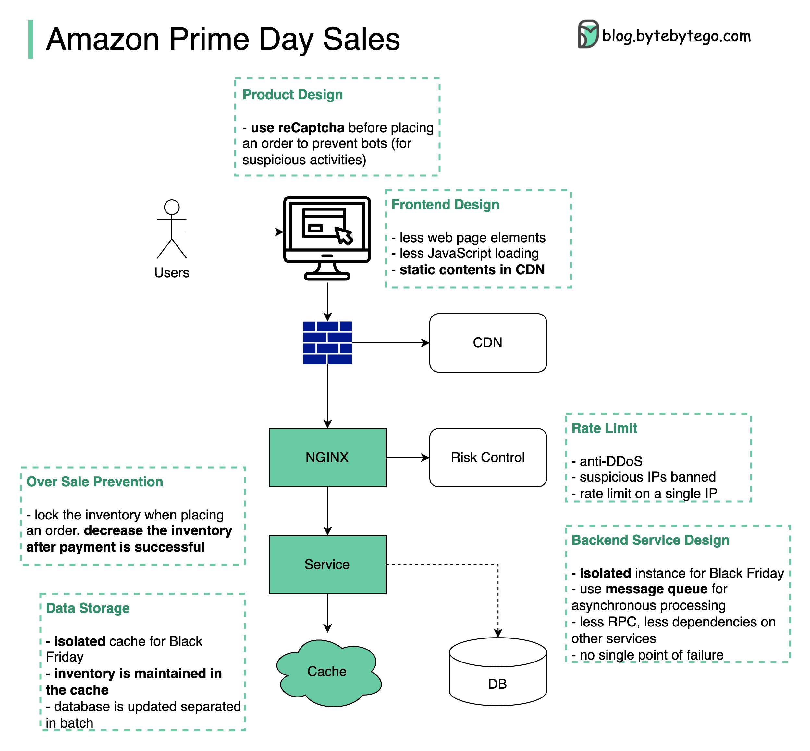

## [Amazon Prime Day Sales](https://twitter.com/alexxubyte/status/1546520282571034625)

> Amazon Prime days are coming. Designing a system with extremely high concurrency, high availability, and quick responsiveness needs to consider many aspects 𝐚𝐥𝐥 𝐭𝐡𝐞 𝐰𝐚𝐲 𝐟𝐫𝐨𝐦 𝐟𝐫𝐨𝐧𝐭𝐞𝐧𝐝 𝐭𝐨 𝐛𝐚𝐜𝐤𝐞𝐧𝐝.

𝐖𝐡𝐞𝐧 𝐢𝐬 𝐭𝐡𝐞 𝐬𝐲𝐬𝐭𝐞𝐦 𝐮𝐬𝐞𝐟𝐮𝐥?
- When a rare or very popular product is released: new iPhones, PS5, etc.
- Limited-time sales: Black Friday sales, Amazon Primday day, etc.

𝐃𝐞𝐬𝐢𝐠𝐧 𝐩𝐫𝐢𝐧𝐜𝐢𝐩𝐥𝐞𝐬:

1. Less is more. Fewer elements on the web page, fewer data queries to the database, fewer web requests, fewer system dependencies

2. Short critical path. Fewer hops among services or merge into one service

3. Async. Use message queues to handle high TPS

4. Isolation. Isolate static and dynamic contents, isolate processes and databases for rare items

5. Overselling is bad. When and how to manage the inventory is important

6. User experience is important. We don’t want to inform users that they have successfully placed orders but later tell them no items are actually available