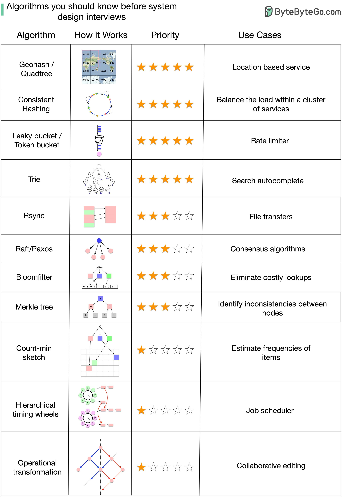

## [What are some of the algorithms we should know before taking system design interviews?](https://twitter.com/alexxubyte/status/1544346786365460480)

> One thing to keep in mind is that understanding “how those algorithms are used in real-world systems” is generally more important than the implementation details in a system design interview.
>
> What do the stars mean in the diagram?
>
> It’s very difficult to rank algorithms by importance objectively. I’m open to suggestions and making adjustments.
>
> - Five-star: Very important. Try to understand how it works and why.
> - Three-star: Important to some extent.
> - One-star: Advanced. Good to know for senior candidates.
>
> I put together a list and explained why they are important.

