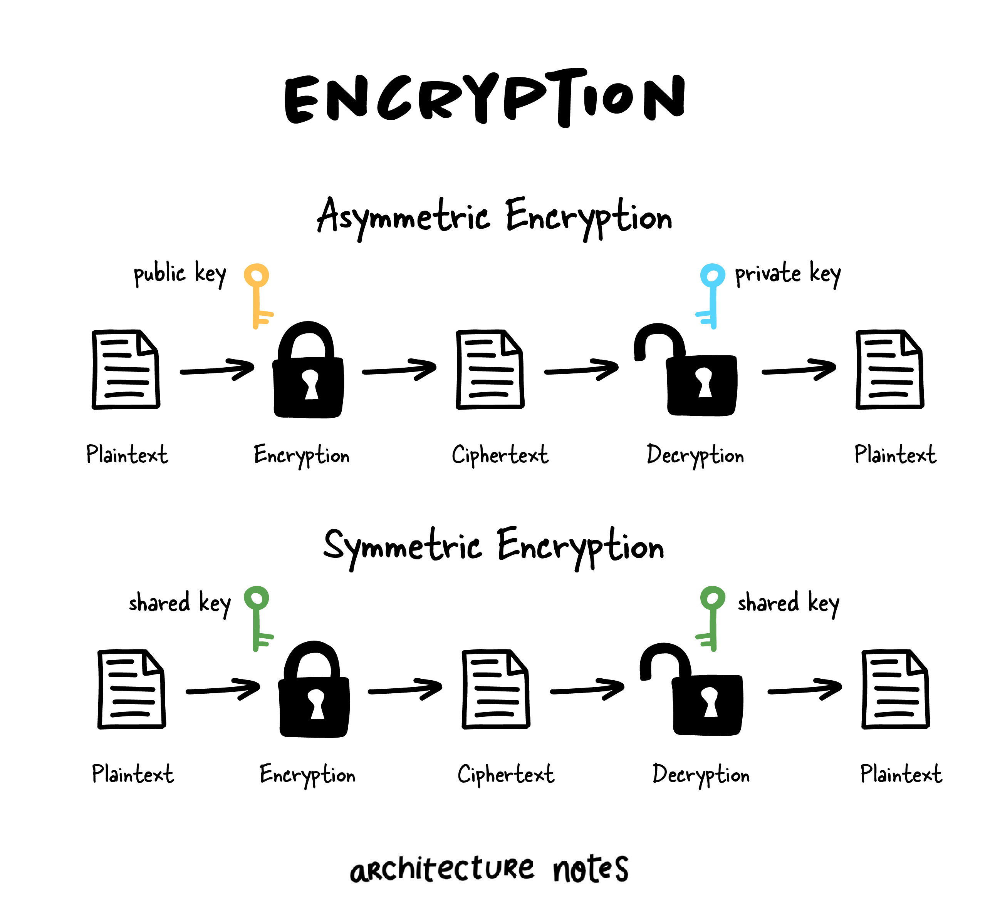

## [How do we design a system using the 𝐞𝐯𝐞𝐧𝐭 𝐬𝐨𝐮𝐫𝐜𝐢𝐧𝐠 paradigm?](https://twitter.com/arcnotes/status/1544697721889570816)

> Let's talk about encryption foundational topic in system design. Encryption involves converting human-readable plaintext into incomprehensible text, which is known as ciphertext and decrypting it back to plaintext again.

There are two classes of encryption, but until 1976 symmetric key encryption was the only show in town. It involves a shared key used to encrypt and decrypt messages. 

The main problem with symmetric key encryption is sharing the shared key securely. Since a third party with the key could also decrypt the message if they got hold of the shared key.

Commonly used symmetric encryption algorithms include:

• AES

• 3-DES

• SNOW

Asymmetric encryption uses a mathematically related pair of keys for encryption and decryption: a public key and a private key.

You can encrypt data with either key, but only its pair can decrypt it. The main benefit of this type of encryption is that you can keep your private key entirely private and publicly share the public key, which people can use to encrypt data for you.

Commonly used asymmetric encryption algorithms include:

• RSA

• Elliptic curve cryptography
 
[Here](https://ee.stanford.edu/~hellman/publications/24.pdf) is the original paper that introduced public key encryption. Called New Directions in Cryptography by Whitfield Diffie and Martin Hellman.
