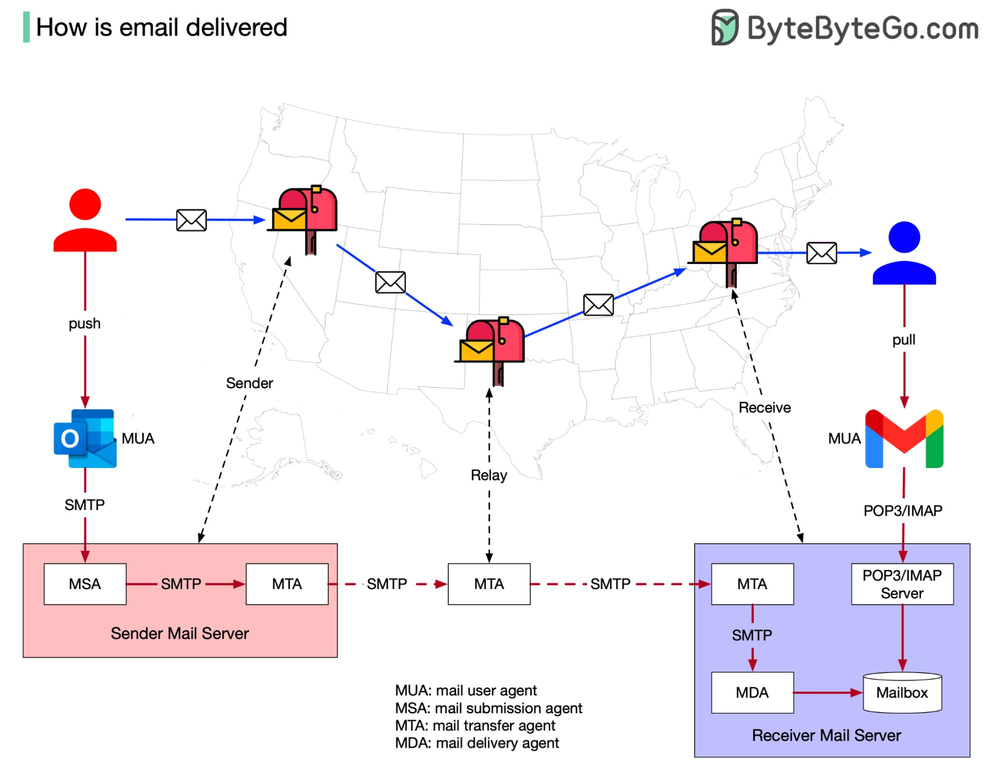

## [Do you know how an email is delivered?](https://twitter.com/alexxubyte/status/1537462742025576449)

> When I first learned how similar email is to traditional ‘snail’ mail, I was surprised. Maybe you will be, too. Allow me to explain.
> 
> In the physical world, if I want to send a postcard to a friend, I would put it in a nearby mailbox. The postal office collects the mail regularly and relays it to the destination postal office. This postal office then puts the postcard in my friend’s mailbox.
> 
> This process usually takes a few days and my friend receives my gratitude in paper form.

> Email functions in a similar way. The terminology changes because it is an internet-based solution, but the fundamentals are the same:

1. Instead of putting mail in a mailbox, the sender pushes an email to the Sender Mail Server using MUA (mail user agent,) such as Outlook or Gmail.
2. Instead of using postal offices to relay mail, MTA (mail transmission agent) relays the email. It communicates via the SMTP protocol.
3. The email is received by the Receiver Mail Server. It stores the email to the Mailbox by using MDA (mail delivery agent.) The receiver uses MUA to retrieve the email using the POP3/IMAP protocol.