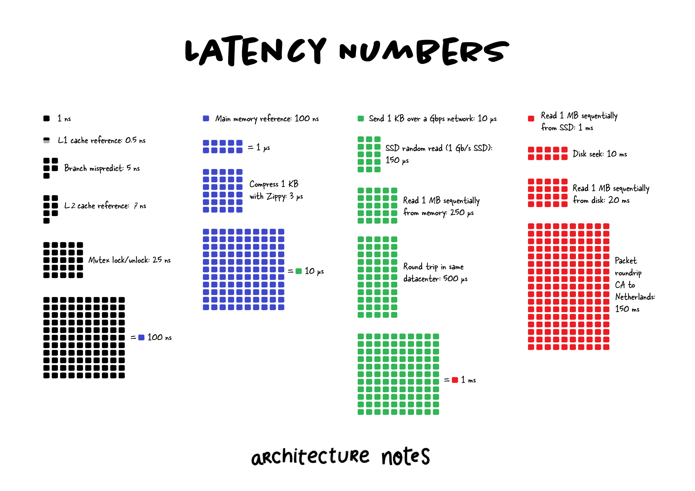

## [Latency Numbers](https://twitter.com/arcnotes/status/1546533103463632896)

> Latency. Latency. You hear about this every day. Understanding latency is essential in all parts of our systems, including registers, main memory, disk, and network. In addition, understanding these latencies is vital so you can reason about various aspects of your system.

- Latency is physically a consequence of the limited velocity at which any physical interaction can propagate, which is always < speed of light.
- Latency always tends to sneak up on you. Oh, 1ms per item processing isn't bad. What if I had to process a billion items? That's just over 11 days. 
- That being said, you need to right-size that time with other portions of your system, like sending data over a network which is much more expensive.
- You can battle it by doing more per roundtrip, but other limits come into play, like bandwidth. You can also colocate data you are going to need closer to where you need it, like content delivery networks (CDNs).