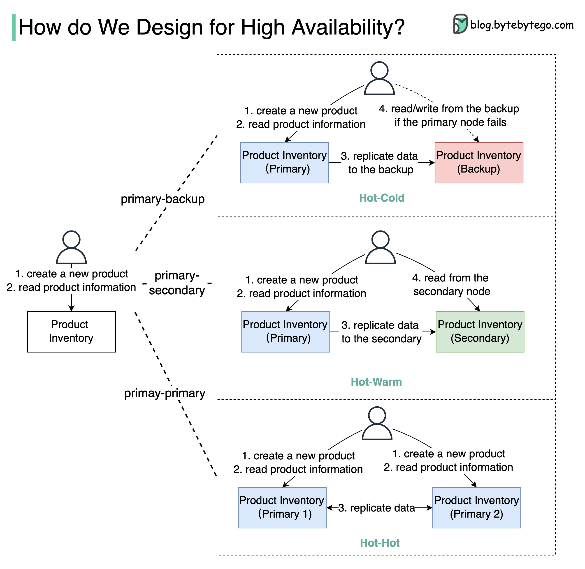

## [What does Availability mean when you design a system?](https://twitter.com/alexxubyte/status/1537100597110792192)

> In the famous CAP theorem by computer scientist Eric Brewer, Availability means all (non-failing) nodes are available for queries in a distributed system.
>
> When you send out requests to the nodes, a non-failing node will return a reasonable response within a reasonable amount of time (with no error or timeout).
> 
> Usually, we design a system for high availability. For example, when we say the design target is 4-9’s, it means the services should be up 99.99% of the time. This also means the services can only be down for 52.5 minutes per year.
> 
> Note that availability only guarantees that we will receive a response; it doesn’t guarantee the data is the most up-to-date.
>
> The diagram below shows how we can turn a single-node “Product Inventory” into a double-node architecture with high availability.

🔹Primary-Backup: the backup node is just a stand-by, and the data is replicated from primary to backup. When the primary fails, we need to manually switch to the backup node.
> The backup node might be a waste of hardware resources.

🔹Primary-Secondary: this architecture looks similar to primary-backup architecture, but the secondary node can take read requests to balance the reading load.
> Due to latency when replicating data from primary to secondary, the data read from the secondary may be inconsistent with the primary.

🔹Primary-Primary: both nodes act as primary nodes, both nodes can handle read/write operations, and the data is replicated between the two nodes. This type of architecture increases the throughput, but it has limited use cases.

> For example, if both nodes need to update the same product, the final state might be unpredictable. Use this architecture with caution!
>
> If we deploy the node on Amazon EC2, which has 90% availability, the double-node architecture will increase availability from 90% to 99%.