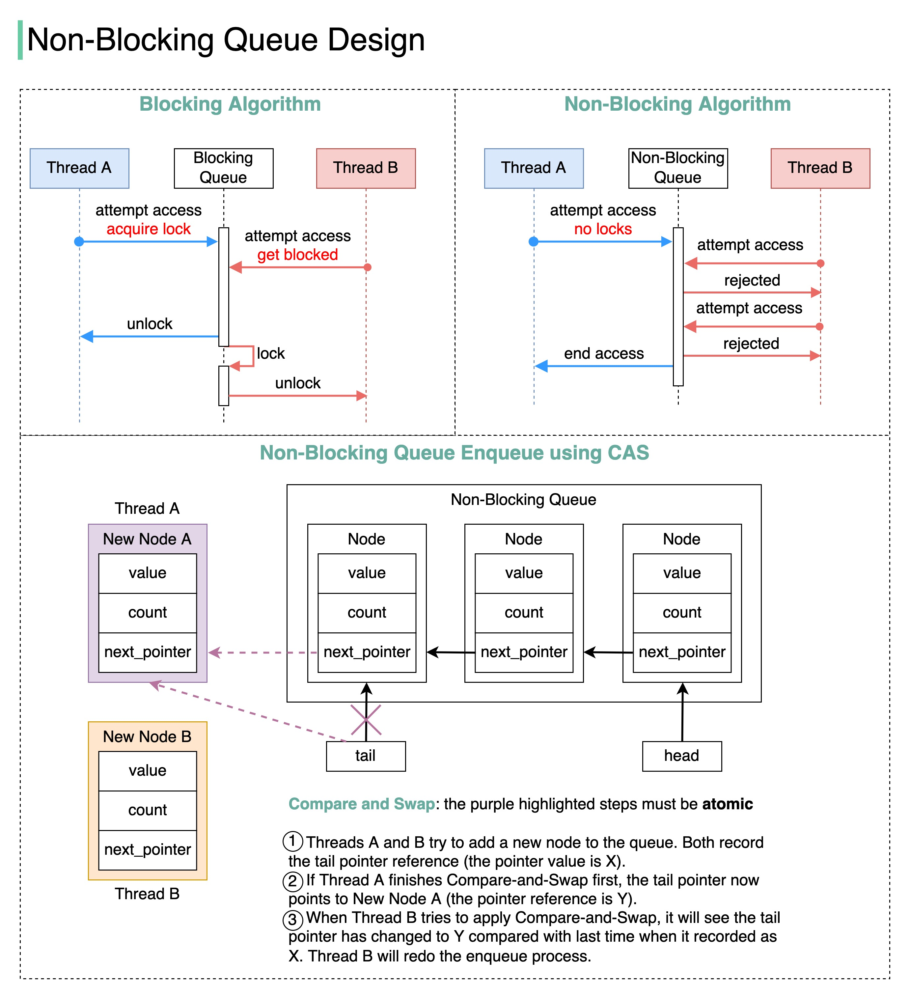

## [How do we implement a 𝐧𝐨𝐧-𝐛𝐥𝐨𝐜𝐤𝐢𝐧𝐠 queue?](https://twitter.com/alexxubyte/status/1542882527110541312)

> What are the differences between blocking and non-blocking algorithms?
> 
> The terms we use when discussing blocking and non-blocking algorithms can be confusing, so let’s start by reviewing the terminology in the concurrency area with a diagram.

🔹blocking

The blocking algorithm uses locks. Thread A acquires the lock first, and Thread B might wait for arbitrary lengthy periods if Thread A gets suspended while holding the lock. This algorithm may cause Thread B to starve.

🔹non-blocking:

The non-blocking algorithm allows Thread A to access the queue, but Thread A must complete a task in a certain number of steps. Other threads like Thread B may still starve due to the rejections.

> This is the main 𝐝𝐢𝐟𝐟𝐞𝐫𝐞𝐧𝐜𝐞 between blocking and non-blocking algorithms: The blocking algorithm blocks Thread B until the lock is released. A non-blocking algorithm notifies Thread B that access is rejected.

🔹starvation-free:

Thread Starvation means a thread cannot acquire access to certain shared resources and cannot proceed. Starvation-free means this situation does not occur.

🔹wait-free:

All threads can complete the tasks within a finite number of steps.

𝘞𝘢𝘪𝘵-𝘧𝘳𝘦𝘦 = 𝘕𝘰𝘯-𝘉𝘭𝘰𝘤𝘬𝘪𝘯𝘨 + 𝘚𝘵𝘢𝘳𝘷𝘢𝘵𝘪𝘰𝘯-𝘧𝘳𝘦𝘦

➡️ Non-Blocking Queue 𝐈𝐦𝐩𝐥𝐞𝐦𝐞𝐧𝐭𝐚𝐭𝐢𝐨𝐧

We can use Compare and Swap (CAS) to implement a non-blocking queue. The diagram below illustrates the algorithm.

➡️ 𝐁𝐞𝐧𝐞𝐟𝐢𝐭𝐬

1. No thread suspension. Thread B can get a response immediately and then decide what to do next. In this way, the thread latency is greatly reduced.
2. No deadlocks. Threads A and B do not wait for the lock to release, meaning that there is no possibility of a deadlock occurring.