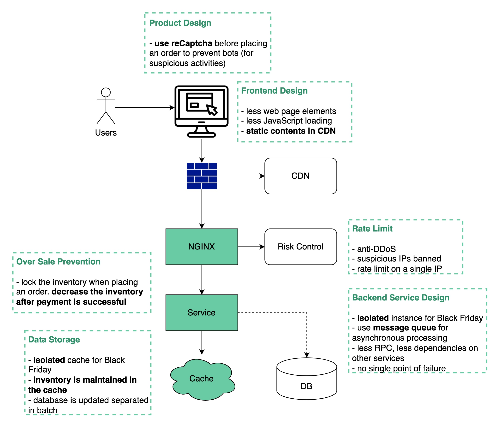

## [Black Friday flash sale](https://blog.bytebytego.com/p/black-friday-flash-sale?s=r)

> Designing a system with extremely high concurrency, high availability and quick responsiveness needs to consider many aspects all the way from frontend to backend.
>
> See the diagram below for details:

### Design principles:

1. Less is more - less element on the web page, fewer data queries to the database, fewer web requests, fewer system dependencies

2. Short critical path - fewer hops among services or merge into one service

3. Async processing- use message queues to handle high TPS

4. Isolation - isolate static and dynamic contents, isolate processes and databases for rare items

5. Overselling is bad. When to decrease the inventory is important

6. User experience is important. We definitely don’t want to inform users that they have successfully placed orders but later tell them no items are actually available