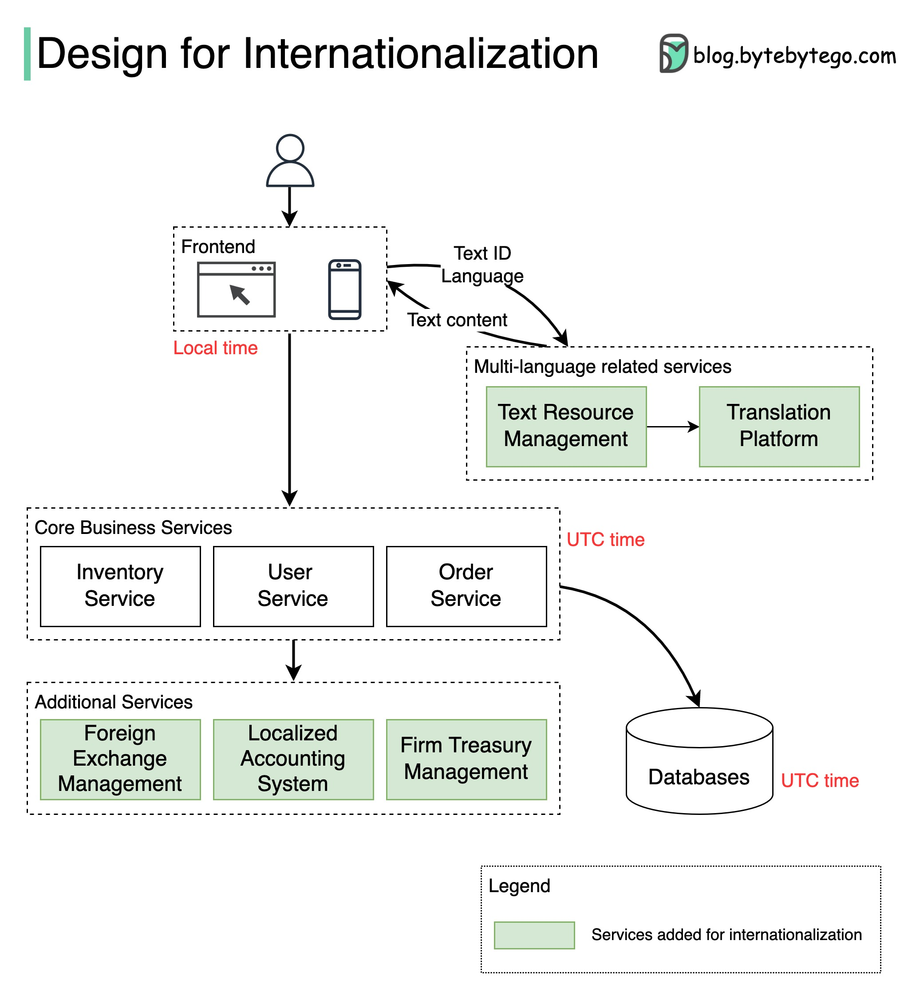

## [How do we design a system for internationalization?](https://twitter.com/alexxubyte/status/1534564641904263168)

> The diagram below shows how we can internationalize a simple e-commerce website.
> 
> Different countries have differing cultures, values, and habits. When we design an application for international markets, we need to localize the application in several ways:

🔹 Language
1. Extract and maintain all texts in a separate system. For example: 
- We shouldn’t put any prompts in the source code.
- We should avoid string concatenation in the code.
- We should remove text from graphics.
2. Use complete sentences and avoid dynamic text elements
3. Display business data such as currencies in different languages

🔹 Layout
1. Describe text length and reserve enough space around the text for different languages.
2. Plan for line wrap and truncation
3. Keep text labels short on buttons
4. Adjust the display for numerals, dates, timestamps, and addresses

🔹 Time zone
- The time display should be segregated from timestamp storage.
- Common practice is to use the UTC (Coordinated Universal Time) timestamp for the database and backend services and to use the local time zone for the frontend display.

🔹 Currency
- We need to define the displayed currencies and settlement currency. We also need to design a foreign exchange service for quoting prices.

🔹 Company entity and accounting
- Since we need to set up different entities for individual countries, and these entities follow different regulations and accounting standards, the system needs to support multiple bookkeeping methods. Company-level treasury management is needed.

> We also need to extract business logic to account for different usage habits in different countries or regions.