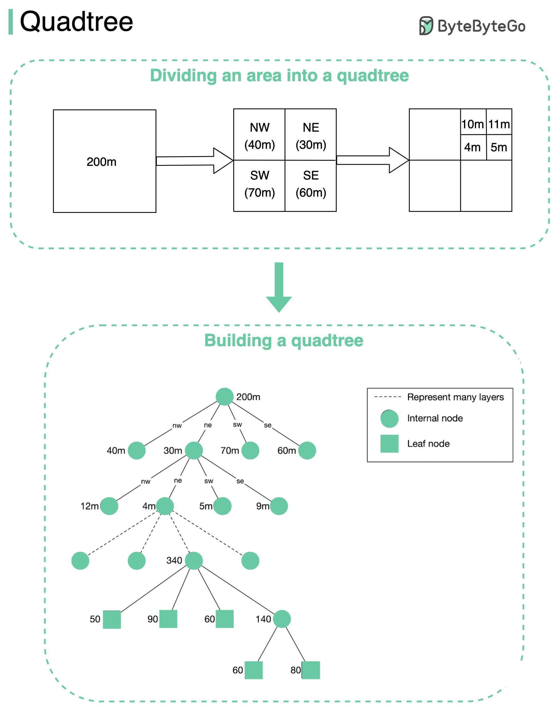

## [How quadtree works?](https://blog.bytebytego.com/p/how-quadtree-works?s=r)

> In this post, let’s explore another data structure to find nearby restaurants on Yelp or Google Maps.

> A quadtree is a data structure that is commonly used to partition a two-dimensional space by recursively subdividing it into four quadrants (grids) until the contents of the grids meet certain criteria (see the first diagram).

> A quadtree is an in-memory data structure, and it is not a database solution. It runs on each LBS (Location-Based Service, see last week’s post) server, and the data structure is built at server start-up time.

> The second diagram explains the quadtree building process in more detail. The root node represents the whole world map. The root node is recursively broken down into 4 quadrants until no nodes are left with more than 100 businesses.

> How to get nearby businesses with quadtree?

- Build the quadtree in memory.

- After the quadtree is built, start searching from the root and traverse the tree, until we find the leaf node where the search origin is.

- If that leaf node has 100 businesses, return the node. Otherwise, add businesses from its neighbors until enough businesses are returned.

> Update LBS server and rebuild quadtree

- It may take a few minutes to build a quadtree in memory with 200 million businesses at the server start-up time.

- While the quadtree is being built, the server cannot serve traffic.

- Therefore, we should roll out a new release of the server incrementally to a small subset of servers at a time. This avoids taking a large swathe of the server cluster offline and causes service brownout. 