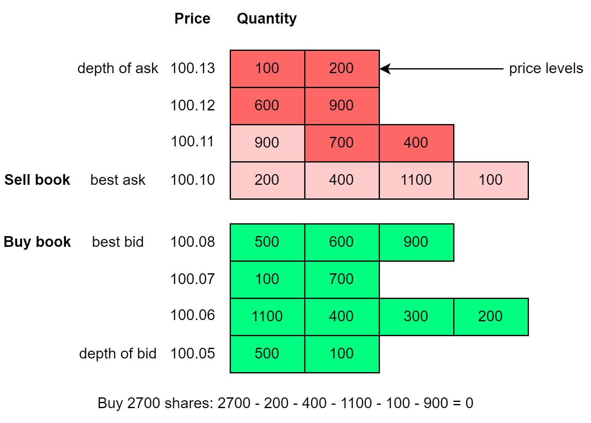

## [Match buy and sell stock orders](https://blog.bytebytego.com/p/match-buy-and-sell-stock-orders?s=r)

> Stock exchanges use order books. An order book is an electronic list of buy and sell orders, organized by price levels. It has a buy book and a sell book, where each side of the book contains a bunch of price levels, and each price level contains a list of orders (first in first out).
>
> The diagram below is an example of price levels and the queued quantity at each price level.

> So what happens when you place a market order to buy 2700 shares in the diagram?

- The buy order is matched with all the sell orders at price 100.10, and the first order at price 100.11 (illustrated in light red).

- Now because of the big buy order which “eats up” the first price level on the sell book, the best ask price goes up from 100.10 to 100.11.

- So when the market is bullish, people tend to buy stocks aggressively, and the price goes up and up.

> An efficient data structure for an order book must satisfy:

- Constant lookup time. Operations include: get volume at a price level or between price levels, query best bid/ask.

- Fast add/cancel/execute/update operations, preferably O(1) time complexity. Operations include: place a new order, cancel an order, and match an order.