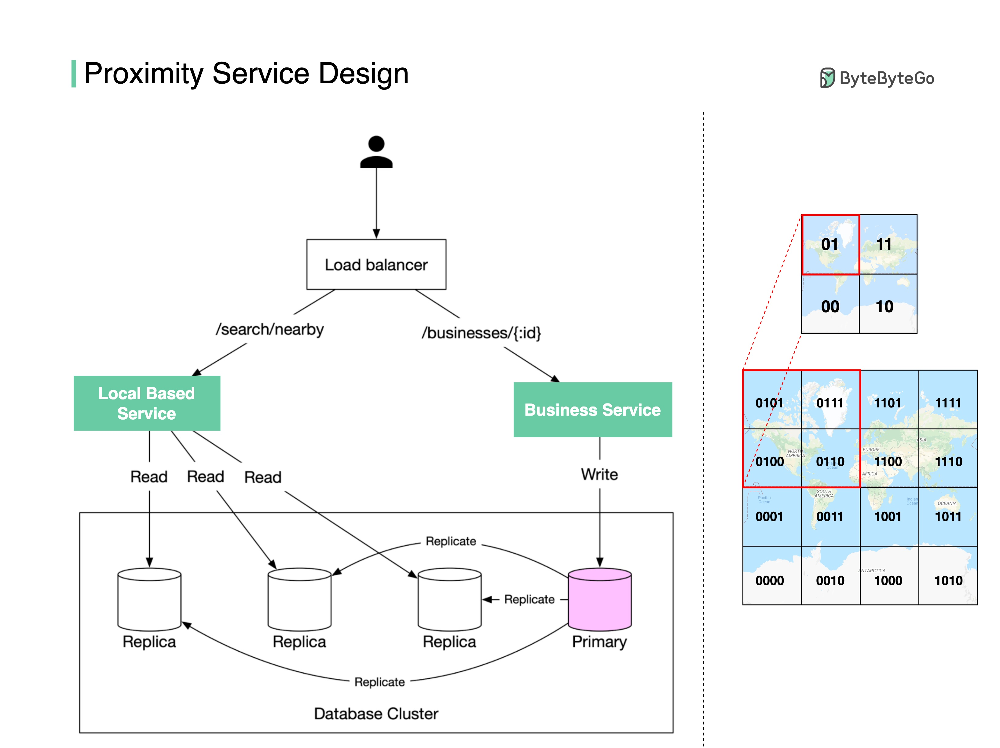

## [Proximity service](https://blog.bytebytego.com/p/proximity-service?s=r)

> How do we find nearby restaurants on Yelp or Google Maps? Here are some design details behind the scenes.
>
> There are two key services (see the diagram below):



- **Business Service**
  - Add/delete/update restaurant information
  - Customers view restaurant details

- **Location-based Service**
  - Given a radius and location, return a list of nearby restaurants 

> How are the restaurant locations stored in the database so that LBS can return nearby restaurants efficiently?
>
> Store the latitude and longitude of restaurants in the database? The query will be very inefficient when you need to calculate the distance between you and every restaurant.
> 
> One way to speed up the search is using the geohash algorithm.

> First, divide the planet into four quadrants along with the prime meridian and equator：

- Latitude range [-90, 0] is represented by 0

- Latitude range [0, 90] is represented by 1

- Longitude range [-180, 0] is represented by 0

- Longitude range [0, 180] is represented by 1

> Second, divide each grid into four smaller grids. Each grid can be represented by alternating between longitude bit and latitude bit.

> So when you want to search for the nearby restaurants in the red-highlighted grid, you can write SQL like:

```
SELECT * FROM geohash_index WHERE geohash LIKE `01%`
```

> Geohash has some limitations. There can be a lot of restaurants in one grid (downtown New York), but none in another grid (ocean). So there are other more complicated algorithms to optimize the process. Let me know if you are interested in the details.