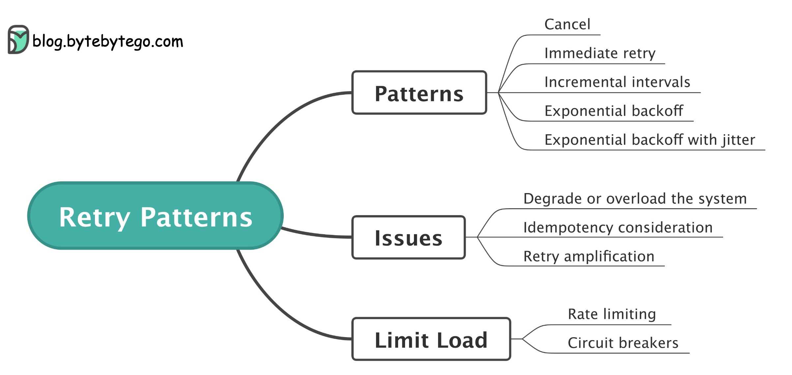

## [Retry patterns](https://blog.bytebytego.com/p/retry-patterns-episode-9?s=r)

> Some failures are transient, which makes it a good candidate to retry the request.
>
> If an application detects a failure when it tries an operation, it can handle the failure using the following strategies:

🔹 Cancel: the client can cancel the request.

🔹 Immediate retry: client immediately resends a request.

🔹 Fixed intervals: wait a fixed amount of time between the time of the failed payment and a new retry attempt.

🔹 Incremental intervals: client waits for a short time for the first retry, and then incrementally increases the time for subsequent retries.

🔹 Exponential backoff: double the waiting time between retries after each failed retry. For example, when a request fails for the first time, we retry after 1 second; if it fails a second time, we wait 2 seconds before the next retry; if it fails a third time, we wait 4 seconds before another retry.

🔹 Exponential backoff with jitter. If all the failed calls back off at the same time, they cause contention or overload again when they retry. Jitter adds some amount of randomness to the backoff to spread the retries.

### Issues
> Retry is not perfect. It can cause issues such as overloading the system, executing the same operation multiple times, and amplifying a problem by creating a storm of requests.
>
> Rate limiting and circuit breakers patterns are commonly used to limit the load and avoid service overload.