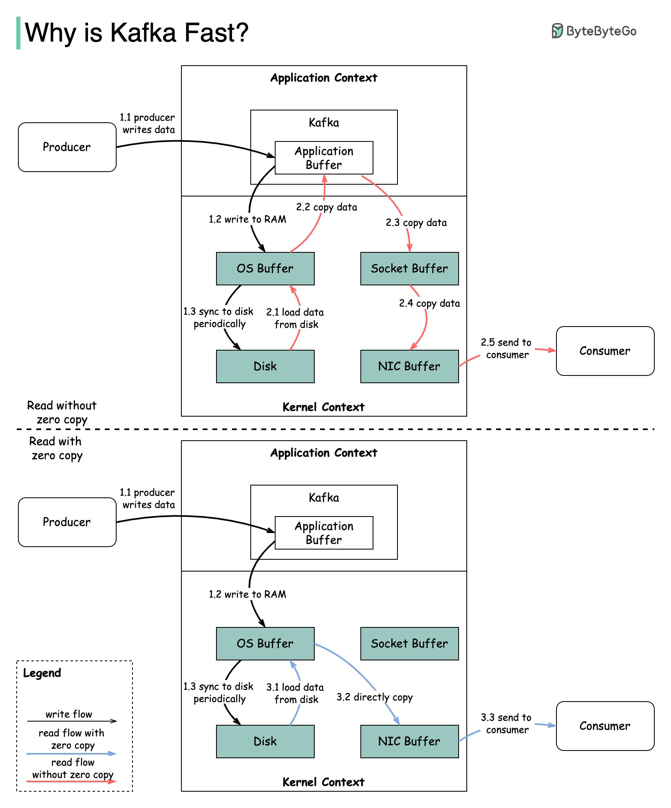

## [Why Kafka is fast?](https://twitter.com/alexxubyte/status/1506663791961919488)

> Kafka achieves low latency message delivery through Sequential I/O and Zero Copy Principle. The same techniques are commonly used in many other messaging/streaming platforms.
>
> The diagram below illustrates how the data is transmitted between producer and consumer, and what zero-copy means.

- Step 1.1 - 1.3: Producer writes data to the disk
- Step 2: Consumer reads data without zero-copy
   1. The data is loaded from disk to OS cache
   2. The data is copied from OS cache to Kafka application
   3. Kafka application copies the data into the socket buffer
   4. The data is copied from socket buffer to network card
   5. The network card sends data out to the consumer
- Step 3: Consumer reads data with zero-copy
   6. The data is loaded from disk to OS cache
   7. OS cache directly copies the data to the network card via sendfile() command
   8. The network card sends data out to the consumer

> Zero copy is a shortcut to save the multiple data copies between application context and kernel context. This approach brings down the time by approximately 65%.