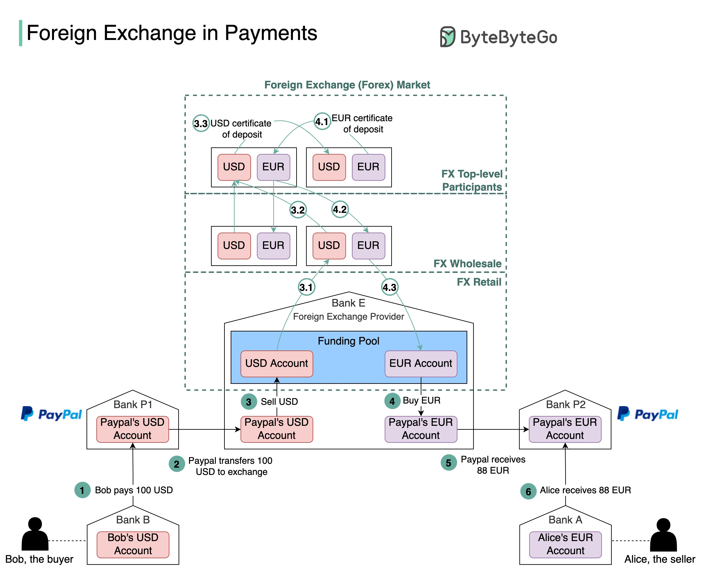

## [How does foreign exchange work from the system's perspective?](https://blog.bytebytego.com/p/how-does-foreign-exchange-work-from?s=r)

>  Have you wondered what happens under the hood when you pay with USD and the seller from Europe receives EUR (euro)? This process is called foreign exchange.
> 
> Suppose Bob (the buyer) needs to pay 100 USD to Alice (the seller), and Alice can only receive EUR. The diagram below illustrates the process.

1. Bob sends 100 USD via a third-party payment provider. In our example, it is PayPal. The money is transferred from Bob’s bank account (Bank B) to PayPal’s account in Bank P1.

2. PayPal needs to convert USD to EUR. It leverages the foreign exchange provider (Bank E). PayPal sends 100 USD to its USD account in Bank E.

3. 100 USD is sold to Bank E’s funding pool.

4. Bank E’s funding pool provides 88 EUR in exchange for 100 USD. The money is put into PayPal’s EUR account in Bank E.

5. PayPal’s EUR account in Bank P2 receives 88 EUR.

6. 88 EUR is paid to Alice’s EUR account in Bank A. 

> Now let’s take a close look at the foreign exchange (forex) market. It has 3 layers:
   
🔹 Retail market. Funding pools are parts of the retail market. To improve efficiency, PayPal usually buys a certain amount of foreign currencies in advance.
   
🔹 Wholesale market. The wholesale business is composed of investment banks, commercial banks, and foreign exchange providers. It usually handles accumulated orders from the retail market.
   
🔹 Top-level participants. They are multinational commercial banks that hold lots of money from different countries.

> When Bank E’s funding pool needs more EUR, it goes upward to the wholesale market to sell USD and buy EUR. When the wholesale market accumulates enough orders, it goes upward to top-level participants. Steps 3.1-3.3 and 4.1-4.3 explain how it works.