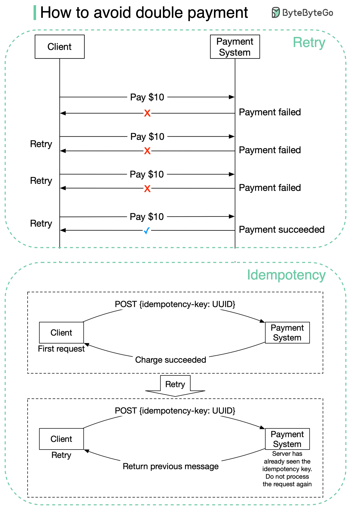

## [How to avoid double payment?](https://blog.bytebytego.com/p/how-to-avoid-double-payment?s=r)

>  One of the most serious problems a payment system can have is to double charge a customer. When we design the payment system, it is important to guarantee that the payment system executes a payment order exactly-once.
>
> At the first glance, exactly-once delivery seems very hard to tackle, but if we divide the problem into two parts, it is much easier to solve. Mathematically, an operation is executed exactly-once if:
> 
1. It is executed at least once.
2. At the same time, it is executed at most once.

> We now explain how to implement at least once using retry and at most once using idempotency check.

> Retry

- Occasionally, we need to retry a payment transaction due to network errors or timeout. Retry provides the at-least-once guarantee. For example, as shown in Figure 10, the client tries to make a $10 payment, but the payment keeps failing due to a poor network connection. Considering the network condition might get better, the client retries the request and this payment finally succeeds at the fourth attempt.

> Idempotency

- From an API standpoint, idempotency means clients can make the same call repeatedly and produce the same result.

- For communication between clients (web and mobile applications) and servers, an idempotency key is usually a unique value that is generated by clients and expires after a certain period of time. A UUID is commonly used as an idempotency key and it is recommended by many tech companies such as Stripe and PayPal. To perform an idempotent payment request, an idempotency key is added to the HTTP header: <idempotency-key: key_value>. 