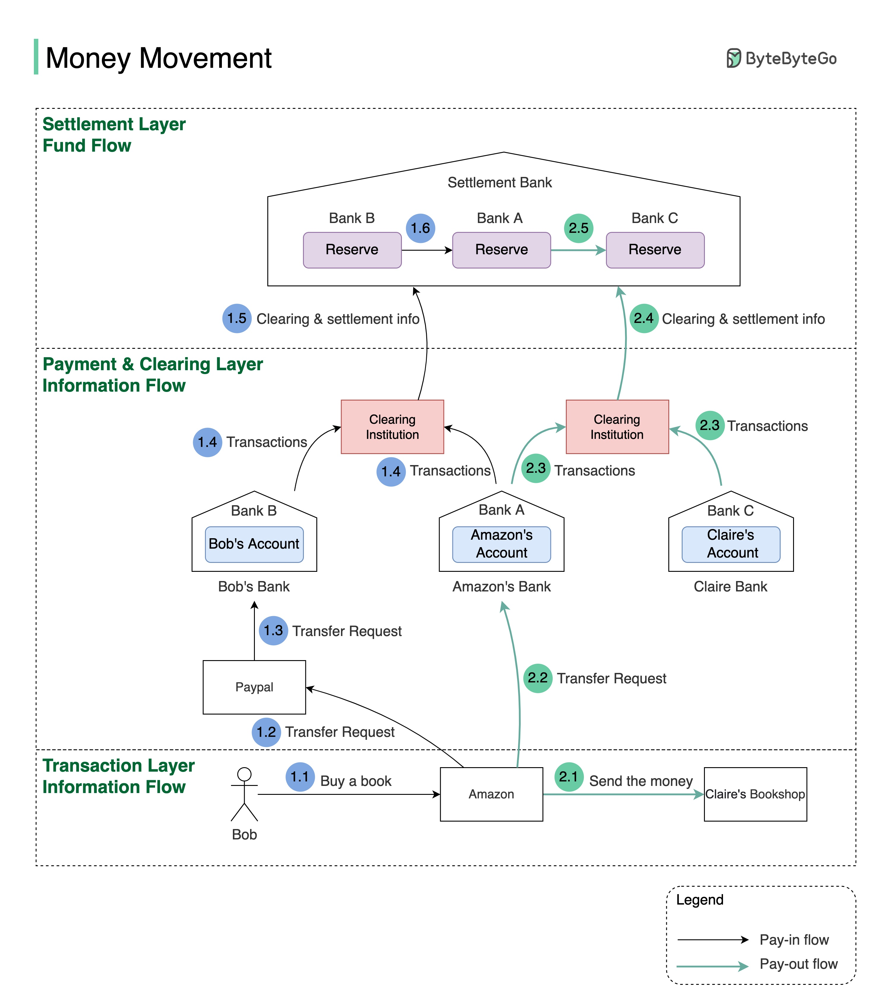

## [Money movement when you buy a product online](https://blog.bytebytego.com/p/money-movement-when-you-buy-a-product?s=r)

>  This is what happens when you buy a product using PayPal/bank card under the hood.

> To understand this, we need to digest two concepts: clearing & settlement. Clearing is a process that calculates who should pay whom with how much money; while settlement is a process where real money moves between reserves in the settlement bank.
> 
> Let’s say Bob wants to buy an SDI book from Claire’s shop on Amazon.

> Pay-in flow (Bob pays Amazon money):

- 1.1 Bob buys a book on Amazon using Paypal.
  
- 1.2 Amazon issues a money transfer request to Paypal.
  
- 1.3 Since the payment token of Bob’s debit card is stored in Paypal, Paypal can transfer money, on Bob’s behalf, to Amazon’s bank account in Bank A.
  
- 1.4 Both Bank A and Bank B send transaction statements to the clearing institution. It reduces the transactions that need to be settled. Let’s assume Bank A owns Bank B $100 and Bank B owns bank A $500 at the end of the day. When they settle, the net position is that Bank B pays Bank A $400.
  
- 1.5 & 1.6 The clearing institution sends clearing and settlement information to the settlement bank. Both Bank A and Bank B have pre-deposited funds in the settlement bank as money reserves, so actual money movement happens between two reserve accounts in the settlement bank. 

> Pay-out flow (Amazon pays the money to the seller: Claire):

- 2.1 Amazon informs the seller (Claire) that she will get paid soon.

- 2.2 Amazon issues a money transfer request from its own bank (Bank A) to the seller bank (bank C). Here both banks record the transactions, but no real money is moved.

- 2.3 Both Bank A and Bank C send transaction statements to the clearing institution.

- 2.4 & 2.5 The clearing institution sends clearing and settlement information to the settlement bank. Money is transferred from Bank A’s reserve to Bank C’s reserve.

> Notice that we have three layers:

- Transaction layer: where the online purchases happen

- Payment and clearing layer: where the payment instructions and transaction netting happen

- Settlement layer: where the actual money movement happen

> The first two layers are called information flow, and the settlement layer is called fund flow.
>
> You can see the information flow and fund flow are separated. In the info flow, the money seems to be deducted from one bank account and added to another bank account, but the actual money movement happens in the settlement bank at the end of the day.
>
> Because of the asynchronous nature of the info flow and the fund flow, reconciliation is very important for data consistency in the systems along with the flow.
>
> It makes things even more interesting when Bob wants to buy a book in the Indian market, where Bob pays USD but the seller can only receive INR.