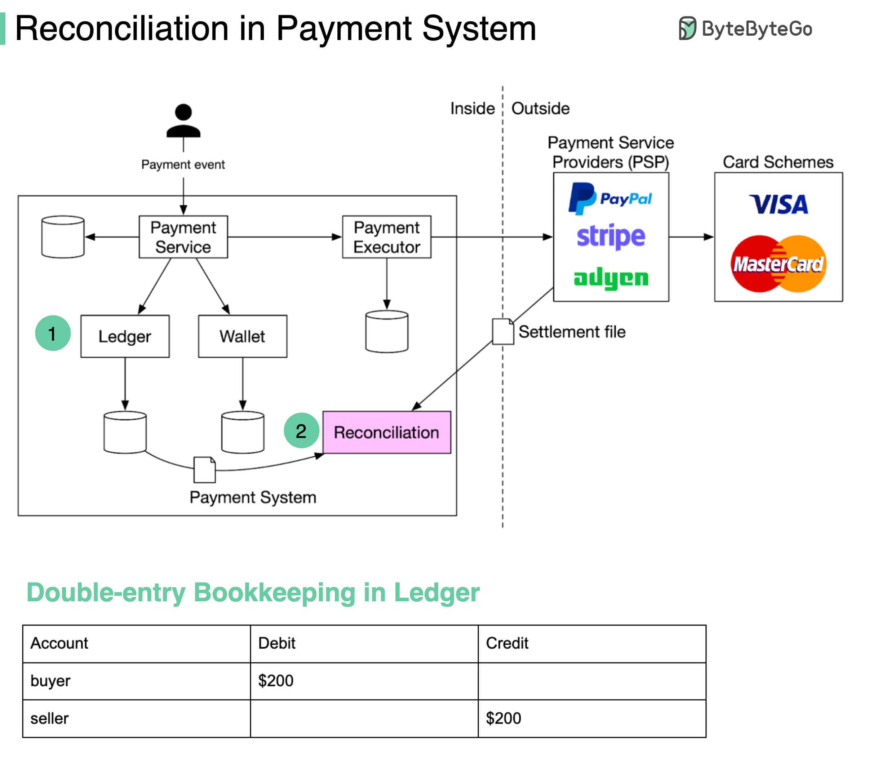

## [Payment reconciliation](https://blog.bytebytego.com/p/payment-system?s=r)

> **Reconciliation** might be the most painful process in a payment system. It is the process of comparing records in different systems to make sure the amounts match each other.

> For example, if you pay $200 to buy a watch with PayPal:
- The eCommerce website should have a record of the $200 purchase order.
- There should be a transaction record of $200 in PayPal (marked with 2 in the diagram).
- The Ledger should record a debit of $200 dollars for the buyer, and a credit of $200 for the seller. This is called double-entry bookkeeping (see the table below).

> **Problem 1**: Data normalization. When comparing records in different systems, they come in different formats. For example, the timestamp can be “2022/01/01” in one system and “Jan 1, 2022” in another.
>
> **Possible solution**: we can add a layer to transform different formats into the same format.

> **Problem 2**: Massive data volume
>
> **Possible solution**: we can use big data processing techniques to speed up data comparisons. If we need near real-time reconciliation, a streaming platform such as Flink is used; otherwise, end-of-day batch processing such as Hadoop is enough.

> **Problem 3**: Cut-off time issue. For example, if we choose 00:00:00 as the daily cut-off time, one record is stamped with 23:59:55 in the internal system, but might be stamped 00:00:30 in the external system (PayPal), which is the next day. In this case, we couldn't find this record in today’s PayPal records. It causes a discrepancy.
> 
> **Possible solution**:  we need to categorize this break as a “temporary break” and run it later against the next day’s PayPal records. If we find a match in the next day’s PayPal records, the break is cleared, and no more action is needed.

> You may argue that if we have exactly-once semantics in the system, there shouldn’t be any discrepancies. But the truth is, there are so many places that can go wrong. Having a reconciliation system is always necessary. It is like having a safety net to keep you sleeping well at night.  
 
---

> 1. **Foreign Currency Problem**: When you operate a store globally, you will come across this problem quite frequently. 
> - To go back to the example from PayPal: if the transaction happens in a currency different from the standard currency of PayPal, this will create another layer, where the transaction is first received in that currency and exchanged to whatever currency your PayPal is using. There needs to be a reliable way to reconcile that currency exchange transaction. It certainly does not help that every payment provider handles this differently.

> 2. Payment providers are only that - intermediaries. 
> - Each purchase does not trigger two events for a company, but actually at least 4. The purchase via PayPal (where both the time and the currency dimension can come into play) trigger the debit/credit pair for the transaction and then, usually a few days later, another pair when the money is transferred from PayPal to a bank account (where there might be yet another FX discrepancy to reconcile if, for example, the initial purchase was in JPY, PayPal is set up in USD and your bank account is in EUR). There needs to be a way to reconcile all of these.

> 3. Some problems also pop up on the buyer side that is very platform-specific. 
> - One example is shadow transaction from PayPal: if you buy two items on PayPal with 1 week of time between the two transactions, PayPal will first debit money from your bank account for transaction A. If at the time of transaction B, transaction A has not gone through completely or is canceled, there might be a world where PayPal will use the money from transaction A to partially pay for transaction B, which leads to only a partial amount of transaction B being withdrawn from the bank account. 

> In practice, this usually looks something like this:
- (1) Your shop assigns an order number to the purchase
- (2) The order number is carried over to the payment provider
- (3) The payment provider creates another internal ID, which is carried over across transactions within the system
- (4) The payment ID is used when you get the payout on your bank account (or the payment provider bundles individual payments, which can be reconciled within the payment provider system)
- (5) Ideally, your payment provider and your shop have an integration/API with the tool you use to (hopefully automatically) create invoices. This usually carries over the order id from the shop (closing the loop) and sometimes even the payment id to match it with the invoice id, which you then can use to reconcile it with your accounts receivable/payable.