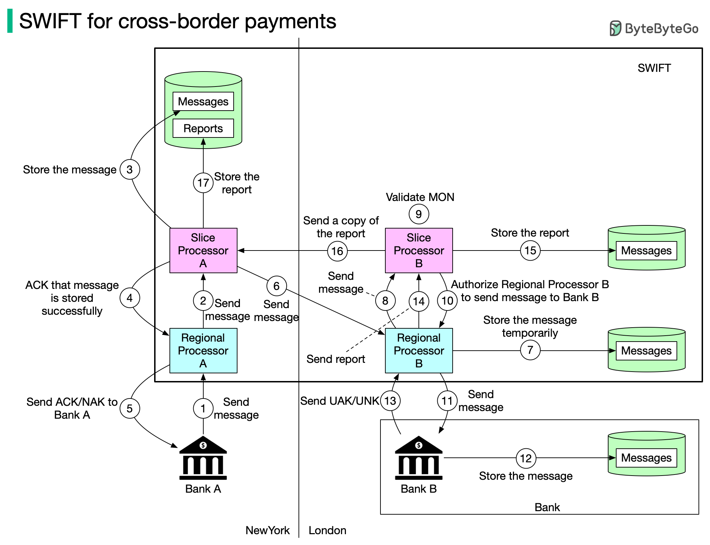

## [SWIFT payment messaging system](https://blog.bytebytego.com/p/swift-payment-messaging-system?s=r)

>  You probably heard about SWIFT. What is SWIFT? What role does it play in cross-border payments? You can find answers to those questions in this post.
>
> The Society for Worldwide Interbank Financial Telecommunication (SWIFT) is the main secure messaging system that links the world’s banks.
>
> The Belgium-based system is run by its member banks and handles millions of payment messages per day. The diagram below illustrates how payment messages are transmitted from Bank A (in New York) to Bank B (in London).

- Step 1: Bank A sends a message with transfer details to Regional Processor A in New York. The destination is Bank B.

- Step 2: Regional processor validates the format and sends it to Slice Processor A. The Regional Processor is responsible for input message validation and output message queuing. The Slice Processor is responsible for storing and routing messages safely.

- Step 3: Slice Processor A stores the message.

- Step 4: Slice Processor A informs Regional Processor A the message is stored.

- Step 5: Regional Processor A sends ACK/NAK to Bank A. ACK means a message will be sent to Bank B. NAK means the message will NOT be sent to Bank B.

- Step 6: Slice Processor A sends the message to Regional Processor B in London.

- Step 7: Regional Processor B stores the message temporarily.

- Step 8: Regional Processor B assigns a unique ID MON (Message Output Number) to the message and sends it to Slice Processor B

- Step 9: Slice Processor B validates MON.

- Step 10: Slice Processor B authorizes Regional Processor B to send the message to Bank B.

- Step 11: Regional Processor B sends the message to Bank B.

- Step 12: Bank B receives the message and stores it.

- Step 13: Bank B sends UAK/UNK to Regional Processor B. UAK (user positive acknowledgment) means Bank B received the message without error; UNK (user negative acknowledgment) means Bank B received checksum failure.

- Step 14: Regional Processor B creates a report based on Bank B’s response, and sends it to Slice Processor B.

- Step 15: Slice Processor B stores the report.

- Step 16 - 17: Slice Processor B sends a copy of the report to Slice Processor A. Slice Processor A stores the report.