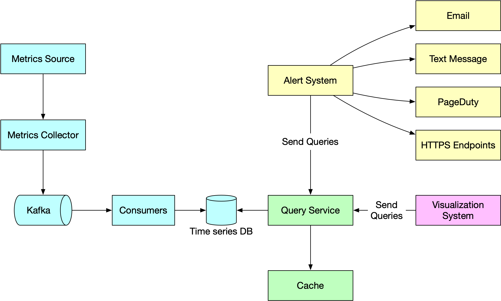

## [Metric monitoring](https://blog.bytebytego.com/p/metric-monitoring?s=r)

> A well-designed metric monitoring and alerting system plays a key role in providing clear visibility into the health of the infrastructure to ensure high availability and reliability. 
> 
> The diagram below explains how it works at a high level.

🔹 Metrics source: This can be application servers, SQL databases, message queues, etc.

🔹 Metrics collector: It gathers metrics data and writes data into the time-series database.

🔹 Time-series database: This stores metrics data as time series. It usually provides a custom query interface for analyzing and summarizing a large amount of time-series data. It maintains indexes on labels to facilitate the fast lookup of time-series data by labels.

🔹 Kafka: Kafka is used as a highly reliable and scalable distributed messaging platform. It decouples the data collection and data processing services from each other.

🔹 Consumers: Consumers or streaming processing services such as Apache Storm, Flink and Spark, process and push data to the time-series database.

🔹 Query service: The query service makes it easy to query and retrieve data from the time-series database. This should be a very thin wrapper if we choose a good time-series database. It could also be entirely replaced by the time-series database’s own query interface.

🔹 Alerting system: This sends alert notifications to various alerting destinations.

🔹 Visualization system: This shows metrics in the form of various graphs/charts.