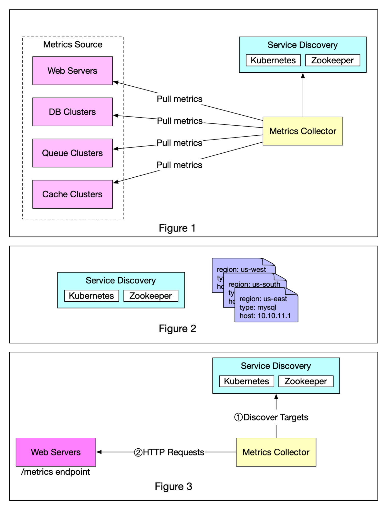

## [Push vs pull in metrics collecting systems](https://blog.bytebytego.com/p/push-vs-pull-in-metrics-collecting?s=r)

> There are two ways metrics data can be collected, pull or push. It is a routine debate as to which one is better and there is no clear answer. In this post, we will take a look at the pull model.

🔹 Figure 1 shows data collection with a pull model over HTTP. We have dedicated metric collectors which pull metrics values from the running applications periodically.

🔹 In this approach, the metrics collector needs to know the complete list of service endpoints to pull data from. One naive approach is to use a file to hold DNS/IP information for every service endpoint on the “metric collector” servers. While the idea is simple, this approach is hard to maintain in a large-scale environment where servers are added or removed frequently, and we want to ensure that metric collectors don’t miss out on collecting metrics from any new servers.

🔹 The good news is that we have a reliable, scalable, and maintainable solution available through Service Discovery, provided by Kubernetes, Zookeeper, etc., wherein services register their availability and the metrics collector can be notified by the Service Discovery component whenever the list of service endpoints changes. Service discovery contains configuration rules about when and where to collect metrics as shown in Figure 2.

🔹 Figure 3 explains the pull model in detail.

1️⃣ The metrics collector fetches configuration metadata of service endpoints from Service Discovery. Metadata include pulling interval, IP addresses, timeout and retries parameters, etc.

2️⃣ The metrics collector pulls metrics data via a pre-defined HTTP endpoint (for example, /metrics). To expose the endpoint, a client library usually needs to be added to the service. In Figure 3, the service is Web Servers.

3️⃣ Optionally, the metrics collector registers a change event notification with Service Discovery to receive an update whenever the service endpoints change. Alternatively, the metrics collector can poll for endpoint changes periodically.