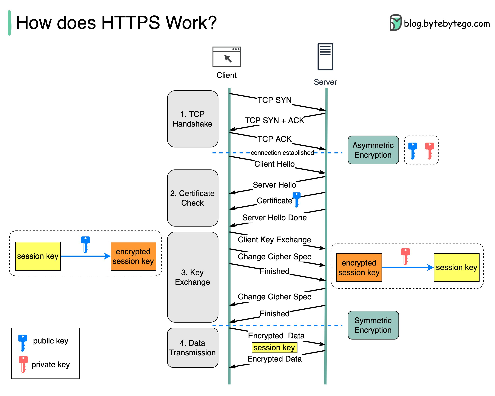

## [How does HTTPS work?](https://twitter.com/alexxubyte/status/1521883407864590337)

> Hypertext Transfer Protocol Secure (HTTPS) is an extension of the Hypertext Transfer Protocol (HTTP.) HTTPS transmits encrypted data using Transport Layer Security (TLS.) If the data is hijacked online, all the hijacker gets is binary code.

> How is the data encrypted and decrypted?
1. Step 1 - The client (browser) and the server establish a TCP connection.
2. Step 2 - The client sends a “client hello” to the server. The message contains a set of necessary encryption algorithms and the latest TLS version it can support. The server responds with a “server hello” so the browser knows whether it can support the algorithms and TLS version.
   The server then sends the SSL certificate to the client. The certificate contains the public key, host name, expiry dates, etc. The client validates the certificate.
3. Step 3 - After validating the SSL certificate, the client generates a session key and encrypts it using the public key. The server receives the encrypted session key and decrypts it with the private key.
4. Step 4 - Now that both the client and the server hold the same session key (symmetric encryption), the encrypted data is transmitted in a secure bi-directional channel.

> Why does HTTPS switch to symmetric encryption during data transmission? There are two main reasons:
1. Security: The asymmetric encryption goes only one way. This means that if the server tries to send the encrypted data back to the client, anyone can decrypt the data using the public key.
2. Server resources: The asymmetric encryption adds quite a lot of mathematical overhead. It is not suitable for data transmissions in long sessions.