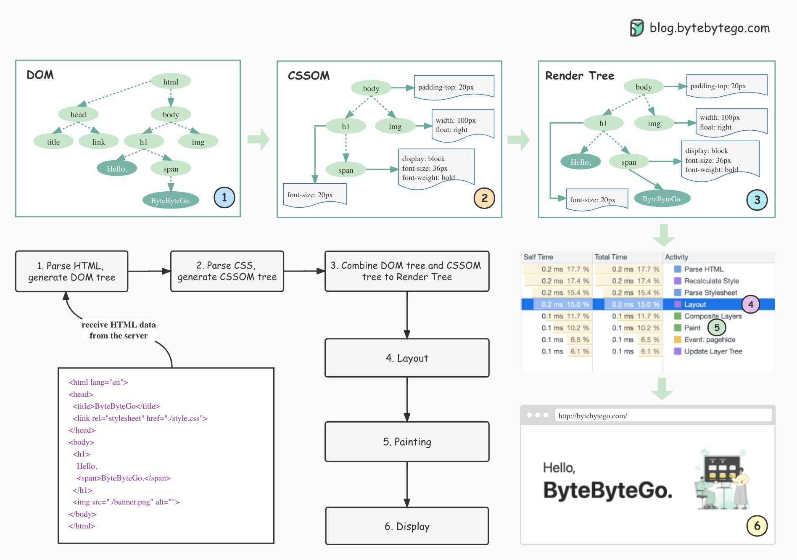

## [How does the browser render a web page?](https://twitter.com/alexxubyte/status/1534201585663741953)

> How does the browser render a web page?

1. Parse HTML and generate Document Object Model (DOM) tree.
> When the browser receives the HTML data from the server, it immediately parses it and converts it into a DOM tree.

2. Parse CSS and generate CSSOM tree.
> The styles (CSS files) are loaded and parsed to the CSSOM (CSS Object Model).

3. Combine DOM tree and CSSOM tree to construct the Render Tree. 
> The render tree maps all DOM structures except invisible elements (such as <head> or tags with display:none; ). In other words, the render tree is a visual representation of the DOM.

4. Layout. 
> The content in each element of the rendering tree will be calculated to get the geometric information (position, size), which is called layout.

5. Painting.
> After the layout is complete, the rendering tree is transformed into the actual content on the screen. This step is called painting. The browser gets the absolute pixels of the content.

6. Display.
> Finally, the browser sends the absolute pixels to the GPU and displays them on the page.