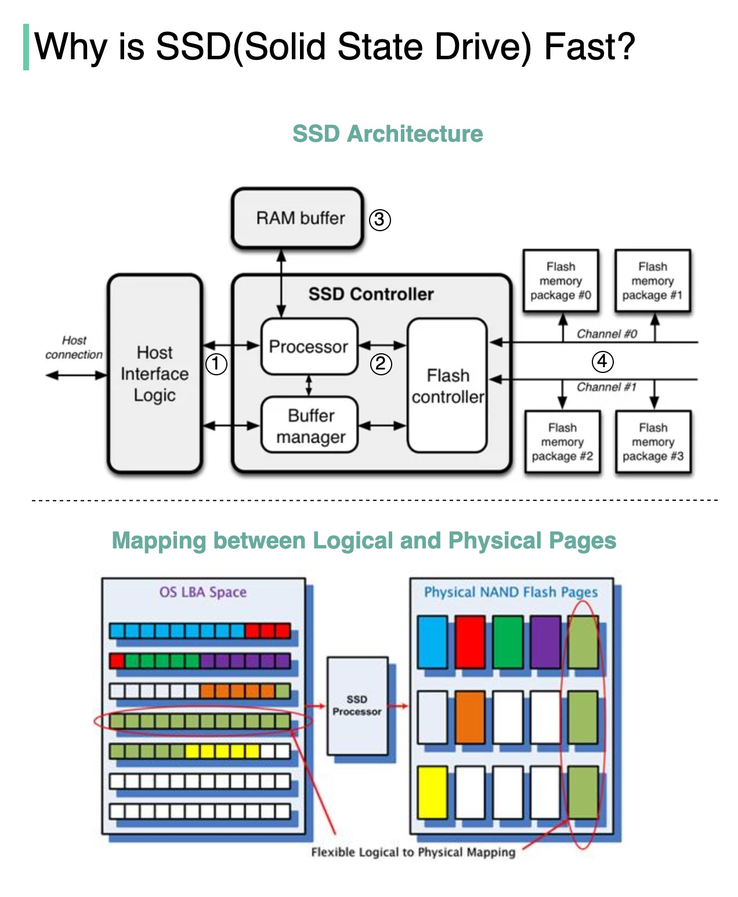

## [Why is a solid-state drive (SSD) fast?](https://blog.bytebytego.com/p/why-is-a-solid-state-drive-ssd-fast?s=r)

> Why is a solid-state drive (SSD) fast?
>
> “A solid state drive reads up to 10 times faster and writes up to 20 times faster than a hard disk drive.” [1].
>
> “An SSD is a flash-memory based data storage device. Bits are stored into cells, which are made of floating-gate transistors. SSDs are made entirely of electronic components, there are no moving or mechanical parts like in hard drives (HDD)” [2].
>
> The diagram below illustrates the SSD architecture.

- Step 1: “Commands come from the user through the host interface” [2]. The interface can be Serial ATA (SATA) or PCI Express (PCIe).

- Step 2: “The processor in the SSD controller takes the commands and passes them to the flash controller” [2].

- Step 3: “SSDs also have embedded RAM memory, generally for caching purposes and to store mapping information” [2].

- Step 4: “The packages of NAND flash memory are organized in gangs, over multiple channels” [2].

> The second diagram illustrates how the logical and physical pages are mapped, and why this architecture is fast.
> 
> SSD controller operates multiple FLASH particles in parallel, greatly improving the underlying bandwidth. When we need to write more than one page, the SSD controller can write them in parallel [3], whereas the HDD has a single head and it can only read from one head at a time.
> 
> Every time a HOST Page is written, the SSD controller finds a Physical Page to write the data and this mapping is recorded. With this mapping, the next time HOST reads a HOST Page, the SSD knows where to read the data from FLASH [3].

---

**Sources**:

[1] *SSD or HDD: Which Is Right for You?: https://www.avg.com/en/signal/ssd-hdd-which-is-best*

[2] *Coding for SSDs: https://codecapsule.com/2014/02/12/coding-for-ssds-part-1-introduction-and-table-of-contents/*

[3] *Overview of SSD Structure and Basic Working Principle: https://www.elinfor.com/knowledge/overview-of-ssd-structure-and-basic-working-principle1-p-11203*