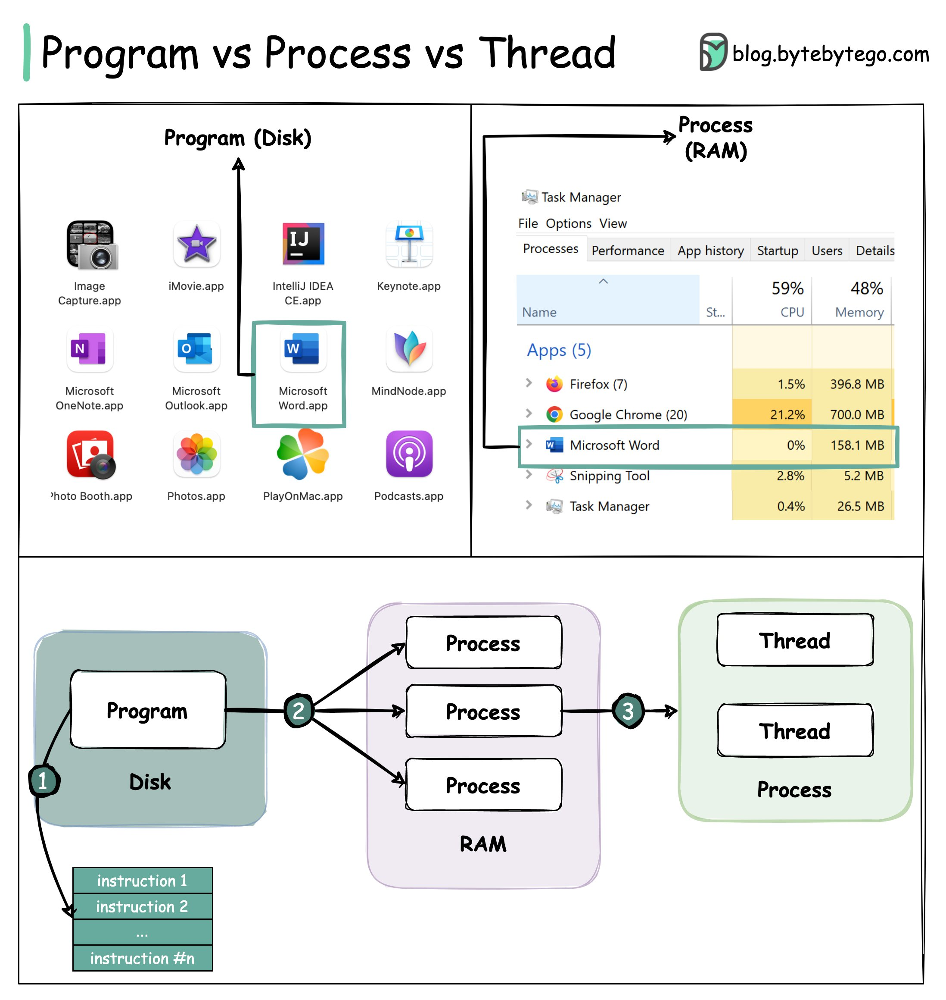

## [Program vs Process vs Thread](https://twitter.com/alexxubyte/status/1518615214316425216)

> A 𝐏𝐫𝐨𝐠𝐫𝐚𝐦 is an executable file containing a set of instructions and passively stored on disk. One program can have multiple processes. For example, the Chrome browser creates a different process for every single tab.
> 
> A 𝐏𝐫𝐨𝐜𝐞𝐬𝐬 means a program is in execution. When a program is loaded into the memory and becomes active, the program becomes a process. The process requires some essential resources such as registers, program counter, and stack.
> 
> A 𝐓𝐡𝐫𝐞𝐚𝐝 is the smallest unit of execution within a process.

1. The program contains a set of instructions.
2. The program is loaded into memory. It becomes one or more running processes.
3. When a process starts, it is assigned memory and resources. A process can have one or more threads. 
4. Main differences between process and thread:
   - Processes are usually independent, while threads exist as subsets of a process.
   - Each process has its own memory space. Threads that belong to the same process share the same memory.
   - A process is a heavyweight operation. It takes more time to create and terminate.
   - Context switching is more expensive between processes.
   - Inter-thread communication is faster for threads. 