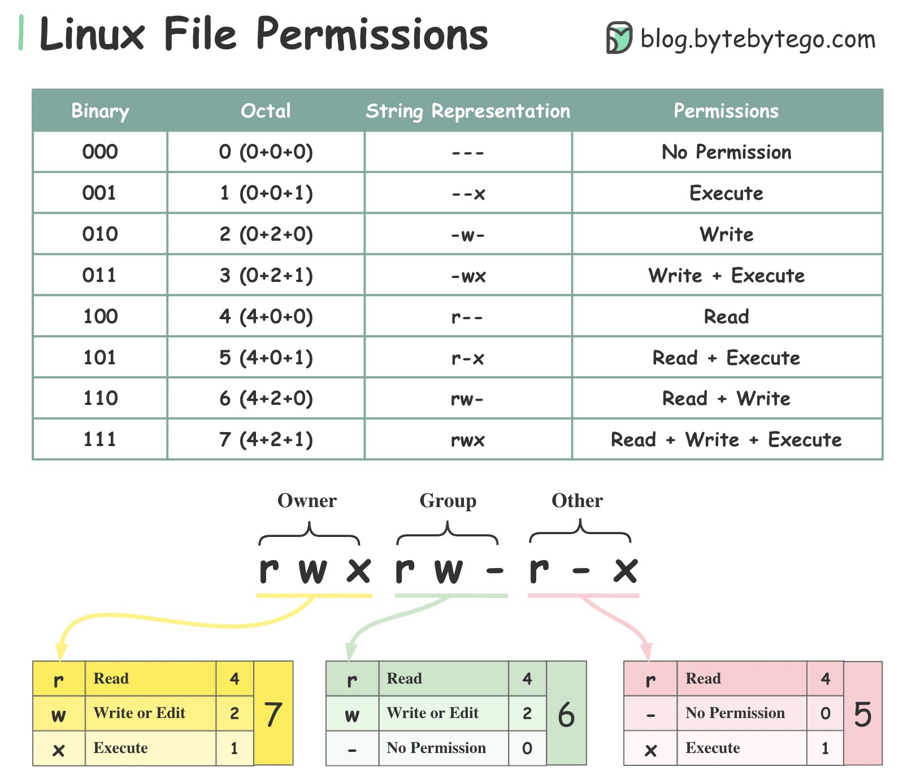

## [Linux file permission](https://twitter.com/alexxubyte/status/1532026886359879681)

> To understand Linux file permissions, we need to understand Ownership and Permission.

### 𝐎𝐰𝐧𝐞𝐫𝐬𝐡𝐢𝐩

🔹Owner: the owner is the user who created the file or directory

🔹Group: a group can have multiple users. All users in the group have the same permissions to access the file or directory

🔹Other: other means those who are not owners or members of the group

### 𝐏𝐞𝐫𝐦𝐢𝐬𝐬𝐢𝐨𝐧
> There are three types of permissions.

🔹Read (r): the read permission allows the user to read a file.

🔹Write (w): the write permission allows the user to change the content of the file.

🔹Execute (x): the execute permission allows a file to be executed.