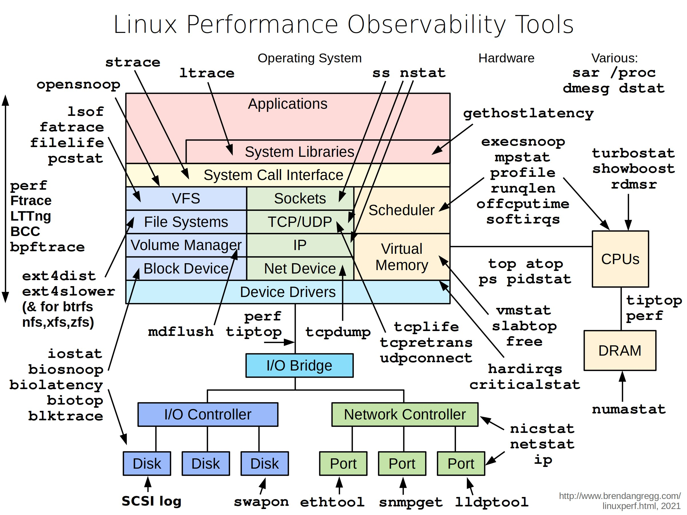

## [Linux performance observability tools](https://twitter.com/alexxubyte/status/1500881250201976832)

> The diagram below illustrates helpful tools in a Linux system.

1. ‘vmstat’ - reports information about processes, memory, paging, block IO, traps, and CPU activity.
2. ‘iostat’ - reports CPU and input/output statistics of the system.
3. ‘netstat’ - displays statistical data related to IP, TCP, UDP, and ICMP protocols.
4. ‘lsof’ - lists open files of the current system.
5. ‘pidstat’ - monitors the utilization of system resources by all or specified processes, including CPU, memory, device IO, task switching, threads, etc.
